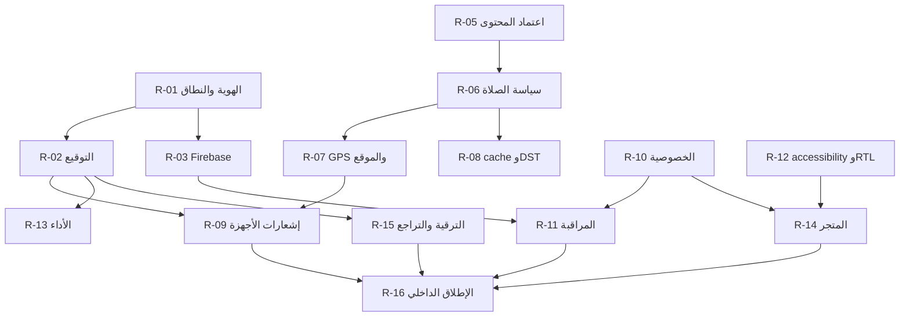

# خطة الإصلاح الشاملة لتطبيق سكينة

**تاريخ الخطة:** 2026-09-29  
**المرجع الأساسي:** [sakina_production_blueprint.md](../sakina_production_blueprint.md)  
**مصادر الحالة الحالية:** [updated_development_plan.md](../updated_development_plan.md)، [docs/production-fix-progress.md](production-fix-progress.md)، [docs/RELEASE_REQUIREMENTS.md](RELEASE_REQUIREMENTS.md)  
**حالة الإصدار الحالية:** غير جاهز للنشر

**آخر دفعة تنفيذية:** تم توحيد اسم عقد جدولة إشعارات الصلاة ليغطي أي تاريخ، وتم تشديد بوابة الإصدار لمطابقة `lib/firebase_options.dart` مع هوية Firebase المعتمدة، وأضيف تشغيل format/analyze/full tests إلى Workflow الإصدار قبل فحوص الهوية والمحتوى.

## 1. الهدف

تحويل التطبيق من نسخة تطوير واسعة الوظائف إلى إصدار إنتاجي موثوق، قابل للصيانة، آمن، قابل للاختبار، ومناسب للنشر على المتجر. تعتمد هذه الخطة على الأدلة الحالية ولا تعتبر وجود الكود دليلاً على نجاح السلوك على جهاز فعلي.

النتيجة المستهدفة هي:

- وظائف القرآن والمحتوى المحلي تعمل دون اتصال.
- مواقيت الصلاة تعتمد على موقع واضح وسياسة حساب معتمدة.
- الإشعارات تعمل ويمكن استعادتها بعد إعادة التشغيل والتحديث.
- المحتوى الديني موثق ومراجع قبل النشر.
- الإصدار موقّع بهوية إنتاجية معتمدة.
- الخصوصية والمراقبة وتجربة المستخدم وإمكانية الوصول موثقة ومختبرة.
- كل بوابة إطلاق لها دليل قابل للمراجعة، وليس مجرد ادعاء شفهي.

## 2. الحالة الحالية المثبتة

### 2.1 ما تم التحقق منه داخل المستودع

- `flutter analyze --no-pub` يمر دون مشاكل.
- `flutter test --no-pub` يمر بـ **300 اختبار ناجح** وفق آخر تشغيل.
- تدفق تحديد موقع الصلاة يدعم GPS والاختيار اليدوي وكتالوج المدن، ولا ينبغي اعتباره عودة صامتة إلى القاهرة.
- تم تنفيذ بحث القرآن المحلي، بما في ذلك بحث الآيات وأسماء السور والأرقام والتطبيع العربي ضمن النطاق المحدد.
- توجد إعدادات موحدة، وثيمات فاتحة وداكنة، وموارد ARB عربية، وخطوط محلية.
- توجد بنية للإشعارات المحلية، وجدولة الصلاة، والاستعادة عبر WorkManager، لكن التسليم الفعلي لم يثبت على أجهزة حقيقية.
- توجد آلية فحص لهوية الإصدار وسلامة المحتوى، وهي مصممة لمنع الإطلاق عند غياب المدخلات المطلوبة.

### 2.2 ما لا يمكن اعتباره منجزاً بعد

- لم يتم إثبات بناء موقّع بهوية إنتاجية معتمدة.
- اعتماد مصادر ومراجعة المحتوى الديني ما زال مطلوباً.
- لم يتم إثبات الإشعارات على جهاز فعلي في حالات foreground/background/terminated وإعادة التشغيل والتحديث.
- لم يتم تنفيذ تدقيق TalkBack/VoiceOver، الحساسات، الأداء، البطارية، أو تثبيت الترقية على جهاز فعلي.
- الخصوصية العامة، رابط السياسة، بيانات الدعم، ومواد المتجر لم تكتمل.
- تدوير أو إلغاء مفتاح YouTube الذي ظهر في تاريخ المستودع غير مثبت من البيئة الحالية.
- سياسة المذهب وطريقة الحساب والارتفاعات العالية والسفر وDST تحتاج قراراً موثقاً.

## 3. قرار المنتج قبل التنفيذ

يجب اعتماد القرارات التالية كتابياً قبل إغلاق بوابات الإصدار:

| القرار | المالك | الناتج المطلوب |
|---|---|---|
| هل الإطلاق Android فقط أم Android وiOS؟ | مالك المنتج | مصفوفة منصات معتمدة |
| اسم التطبيق ومعرّفات Android/iOS النهائية | المنتج + DevOps | مصفوفة هوية إصدار |
| مشروع Firebase المعتمد لكل منصة | DevOps | مشروع واحد أو سياسة موثقة للتعدد |
| هل المنتج يعتمد إشعارات محلية فقط؟ | المنتج + الهندسة | قرار معماري؛ الإعداد الحالي محلي فقط |
| طريقة حساب الصلاة والمذهب والارتفاعات العالية | المنتج + مختص محتوى | سياسة حساب وإظهار واضحة |
| مصادر القرآن والحديث والأدعية والأذكار | مسؤول المحتوى/المراجع | مصدر، إصدار، ترخيص، وتوقيع مراجعة |
| سياسة الخصوصية والاحتفاظ والحذف | المنتج + قانوني | رابط عام وتاريخ اعتماد |

لا يبدأ نشر عام قبل إغلاق هذه القرارات أو توثيق سبب استثناء أي منها.

## 4. الأولويات الحالية

### P0: مانعة للإصدار

1. تثبيت الهوية الإنتاجية، مشروع Firebase، وبيانات التوقيع.
2. اعتماد المحتوى الديني ومصادره وتراخيصه.
3. تنفيذ مصفوفة الإشعارات على أجهزة فعلية.
4. استكمال الخصوصية وبيانات المتجر والدعم.
5. تنفيذ مصفوفة الأجهزة والاعتمادية وإمكانية الوصول.

### P1: مطلوبة قبل الإطلاق أو قبل التوسع

1. تدوير/إلغاء مفتاح YouTube المكشوف وإثبات ذلك.
2. اعتماد سياسة الصلاة للسفر وDST والمذهب والارتفاعات العالية.
3. التحقق من Crashlytics وAnalytics على مشروع Firebase المعتمد.
4. إنهاء المراجعة الأمنية المستقلة.
5. استكمال تشغيل يوم كامل من الإشعارات وإعادة الجدولة.
6. إكمال حالات الخطأ والبيانات القديمة في الشاشات الشبكية.

### P2: تحسينات ما بعد ثبات الإصدار

1. قياس الأداء على جهاز منخفض المواصفات.
2. تحسين الوسائط دون اتصال وإظهار freshness/stale بوضوح.
3. تقليل الديون التقنية والتسمية غير المتسقة.
4. تحسين البحث العالمي أو سجل البحث إن أثبتت البيانات حاجة المستخدم.

### P3: ميزات مستقبلية

التقويم الهجري، تشغيل تلاوات القرآن، أدوات الشاشة الرئيسية، سجل الإشعارات، وفترات الهدوء. لا تدخل هذه العناصر مسار الإصدار الأول.

## 5. خطة التنفيذ المرحلية

### المرحلة 0: تثبيت النطاق والقرارات

**الهدف:** منع تنفيذ أعمال مبنية على افتراضات متغيرة.

**المهام:**

- اعتماد منصة الإطلاق ومعرّفات الحزم.
- اعتماد مشروع Firebase وملفات الإعداد الأصلية.
- اعتماد قرار local-only notifications أو تعريف عقد backend حقيقي.
- اعتماد سياسة مواقيت الصلاة.
- تعيين مسؤول المحتوى ومراجع مؤهل ومسؤول الخصوصية.
- إنشاء سجل أدلة الإصدار يتضمن الجهاز، النظام، الإصدار، الوقت، المنطقة، النتيجة، والملف المرفق.

**معيار الإغلاق:** كل قرار له مالك وتاريخ اعتماد ومرفق أو رابط داخلي، ولا توجد قيمة تجريبية معلقة في مصفوفة الهوية.

### المرحلة 1: إغلاق مخاطر الهوية والأمن

**الهدف:** منع إصدار غير قابل للنشر أو يحتوي على سر مكشوف.

**المهام:**

- اختيار Android application ID وiOS bundle ID نهائيين.
- إنشاء أو استلام keystore إنتاجي وحفظه خارج المستودع.
- ضبط `key.properties` أو أسرار CI دون إضافتها إلى Git.
- تنزيل ملفات Firebase الأصلية المطابقة للهوية.
- تدوير مفتاح YouTube الذي ظهر في التاريخ، وإلغاء القديم، ثم تحديث إعدادات CI المحلية.
- فحص التاريخ المتاح بحثاً عن المفاتيح، مع توثيق حدود الفحص.
- تشغيل `verify_release.py` و`verify_content.py` من بيئة Python موثوقة في CI.
- بناء APK/AAB موقّع وفحص بصمته واسم الحزمة.

**معيار القبول:** بوابة الهوية تمر، والبناء الموقّع يثبت أنه ليس Debug، ولا توجد أسرار جديدة في الملفات أو السجلات.

### المرحلة 2: اعتماد المحتوى الديني

**الهدف:** ضمان أن ما يعرضه التطبيق قابل للتتبع والمراجعة.

**المهام:**

- لكل مجموعة محتوى: تحديد المصدر، الإصدار، الترخيص، تاريخ الاستلام، hash، وحالة المراجعة.
- مراجعة نص القرآن ومقارنته بالنسخة المرجعية المعتمدة دون تغيير النص أثناء الإصلاح البرمجي.
- مراجعة الحديث والأدعية والأذكار والأسماء والمعاني بواسطة مراجع مؤهل.
- توثيق التصحيحات في إصدار محتوى مستقل.
- عرض مصدر مناسب داخل التطبيق، وعدم عرض محتوى غير معتمد بصيغة توحي بالقطعية.
- منع بوابة الإصدار عند بقاء `approvalStatus` في حالة pending.

**معيار القبول:** كل مجموعة مدرجة في `content_manifest.json` لها اعتماد موثق، وتنجح بوابة سلامة المحتوى مع وضع approval.

### المرحلة 3: تثبيت الصلاة والموقع والإشعارات

**الهدف:** جعل وظيفة الصلاة قابلة للثقة في الاستخدام اليومي.

**المهام:**

- اعتماد طريقة الحساب والمذهب والارتفاعات العالية وسياسة التقريب.
- اختبار GPS المسموح والمرفوض والمرفوض دائماً.
- اختبار الاختيار اليدوي، تغيير المدينة، السفر، تغيير المنطقة الزمنية، DST، وتغيير التاريخ.
- إظهار المكان والطريقة والمنطقة الزمنية وتاريخ البيانات وحالة freshness/stale.
- اختبار cache صالح، cache قديم، عدم وجود cache، انقطاع الشبكة، واستجابة API تالفة.
- جدولة إشعارات اليوم والأيام المستقبلية من البيانات المخزنة.
- اختبار الصلاحيات، exact alarm، Doze، إعادة التشغيل، تحديث التطبيق، وإغلاقه قسرياً.
- اختبار الضغط على الإشعار من foreground/background/terminated، بما في ذلك payload غير صالح.
- توثيق قيود الشركات المصنعة التي تمنع التسليم في بعض أوضاع توفير الطاقة.

**معيار القبول:** لا يوجد fallback صامت، وتنجح كل حالات المصفوفة مع تسجيل expected/actual/evidence.

### المرحلة 4: الخصوصية والمراقبة والتشغيل

**الهدف:** توفير أساس تشغيلي وقانوني قبل النشر.

**المهام:**

- نشر سياسة خصوصية عامة باللغة المناسبة مع رابط دعم.
- مراجعة بيانات الموقع والإشعارات والتخزين والـ analytics وأي SDK.
- توثيق الحذف وإعادة الضبط والاحتفاظ.
- تفعيل Crashlytics وAnalytics فقط بعد اعتماد المشروع والموافقة المطلوبة.
- اختبار opt-in وopt-out وعدم إرسال الموقع أو نصوص البحث أو سجل القراءة.
- إنشاء لوحات تنبيه للانهيارات وANR وفشل الإشعارات ومعدل فتح التطبيق.
- كتابة Runbook للحوادث والتراجع والإصدار المرحلي.

**معيار القبول:** السياسة منشورة، بيانات المتجر متسقة معها، أحداث الاختبار تظهر في المشروع الصحيح، وإلغاء الموافقة يمنع الإرسال ويزيل البيانات المعلقة حيث ينطبق.

### المرحلة 5: الجودة وإمكانية الوصول والأداء

**الهدف:** إثبات جودة الاستخدام خارج اختبارات الوحدات.

**المهام:**

- تشغيل تدفقات Quran/prayer/Qibla/Khatma/notifications على Android فعلي.
- تشغيل تدفقات الإشعارات وQibla وVoiceOver على iOS إذا كان ضمن النطاق.
- اختبار TalkBack/VoiceOver، حجم خط كبير، contrast، ترتيب التركيز، labels، reduced motion، والأهداف اللمسية.
- اختبار RTL في النصوص الطويلة، الأرقام، الأسهم، الحوارات، البحث، والإشعارات.
- قياس startup، first useful frame، frame timing، الذاكرة، حجم الحزمة، الشبكة، والبطارية.
- اختبار الترقية من نسخة سابقة، فقدان التخزين، app kill، background/resume، وتغيير اللغة/الثيم.
- إضافة أي regression test يكشف خللاً مثبتاً، دون اختراع متطلبات غير مدعومة.

**معيار القبول:** كل حالة حرجة لها دليل، ولا توجد مشكلة حرجة مفتوحة في إمكانية الوصول أو الأداء أو الاعتمادية.

### المرحلة 6: تجهيز المتجر والإصدار المرشح

**الهدف:** إنتاج نسخة يمكن مراجعتها ونشرها.

**المهام:**

- تجميد الميزات.
- تحديث رقم الإصدار وسجل التغييرات.
- بناء Release Candidate موقّع.
- فحص APK/AAB، الصلاحيات، الحزمة، Firebase، الأصول، والـ symbols.
- تجهيز العنوان والوصف واللقطات وبيانات التصنيف والرابط القانوني.
- تنفيذ قبول المنتج النهائي على النسخة المرشحة.
- فتح إطلاق داخلي أو staged rollout فقط بعد مرور كل البوابات.

**معيار القبول:** لا توجد P0، وكل بوابات الإصدار السبع تمر، ويوقع مالك المنتج وQA وDevOps على محضر القبول.

### المرحلة 7: الإطلاق والمراقبة

**الهدف:** تقليل مخاطر أول إصدار واكتشاف الانحراف بسرعة.

**المهام:**

- إطلاق داخلي محدود.
- مراقبة 24 إلى 48 ساعة لمعدل الانهيار وANR والإشعارات والتقييمات.
- رفع النطاق تدريجياً إذا بقيت المؤشرات ضمن الحدود.
- الاحتفاظ بالنسخة السابقة وخطة rollback.
- فتح دورة تحسين مبنية على الأدلة، لا على التخمين.

**معيار الإغلاق:** تقرير ما بعد الإطلاق يتضمن المؤشرات، الحوادث، قرارات التراجع أو التوسيع، والعمل التالي.

## 6. سجل التنفيذ الرئيسي

| المعرف | الإجراء | الأولوية | المالك | يعتمد على | دليل الإغلاق |
|---|---|---:|---|---|---|
| R-01 | اعتماد منصة وهوية الإصدار | P0 | Product/DevOps | قرار الإطلاق | مصفوفة هوية معتمدة |
| R-02 | إنشاء التوقيع وبناء Release | P0 | DevOps | R-01 | APK/AAB وبصمة التوقيع |
| R-03 | توحيد Firebase وملفات native | P0 | Mobile/DevOps | R-01 | build وruntime على المشروع الصحيح |
| R-04 | تدوير مفتاح YouTube المكشوف | P1 | Security/Owner | صلاحية حساب Google | إثبات الإلغاء والاستبدال |
| R-05 | اعتماد المصادر الدينية | P0 | Content/Reviewer | تعيين المراجع | manifest معتمد وتقارير مراجعة |
| R-06 | اعتماد سياسة الصلاة | P1 | Product/Reviewer | R-05 | وثيقة طريقة الحساب |
| R-07 | اختبار GPS والموقع اليدوي | P0 | QA/Mobile | R-06 | مصفوفة إذن/سفر/منطقة |
| R-08 | اختبار cache وDST والتاريخ | P1 | QA/Mobile | R-06 | حالات stale/rollover موثقة |
| R-09 | اختبار الإشعارات الفعلي | P0 | QA | R-02، R-07 | سجل التسليم وإعادة التشغيل |
| R-10 | نشر الخصوصية والدعم | P0 | Product/Legal | قرار البيانات | رابط عام معتمد |
| R-11 | اختبار Crashlytics/Analytics | P1 | DevOps/Mobile | R-03، R-10 | أحداث في المشروع الصحيح |
| R-12 | تدقيق accessibility وRTL | P0 | QA/UX | Release Candidate | تقرير أجهزة |
| R-13 | قياس الأداء والبطارية | P1 | Mobile/QA | Release Candidate | traces ومقارنة baseline |
| R-14 | تجهيز مواد المتجر | P0 | Product/Design | R-10، R-12 | listing وscreenshots معتمدة |
| R-15 | اختبار الترقية والتراجع | P0 | QA/DevOps | R-02 | تقرير install/upgrade/rollback |
| R-16 | إطلاق داخلي ومراقبة | P0 | DevOps/Product | R-09، R-14، R-15 | تقرير 48 ساعة |

## 7. الاعتماديات والمسار الحرج

**المسار الحرج:** `R-01 → R-02/R-03 → R-07/R-09 → R-12/R-15 → R-14 → R-16`، مع إغلاق `R-05` و`R-10` قبل قبول الإصدار.

**أعمال يمكن تنفيذها بالتوازي:** إعداد مواد المتجر، مراجعة الخصوصية، إعداد الأجهزة، تدقيق المحتوى، وإضافة اختبارات regression، بشرط عدم تغيير نطاق المنتج أو المحتوى المعتمد أثناء التنفيذ.

## 8. مصفوفة الاختبار الإلزامية

| المجال | الحالات الدنيا | النتيجة المطلوبة |
|---|---|---|
| أول تشغيل | online/offline، onboarding، رفض الإشعارات | لا تعليق ولا فقدان حالة |
| الصلاة | GPS allow/deny، يدوي، سفر، DST، منتصف الليل | مكان وطريقة وتاريخ واضحون ونتيجة صحيحة حسب السياسة |
| الشبكة | timeout، 5xx، payload تالف، cache صالح/قديم | رسالة محلية، retry، وstale واضح |
| الإشعارات | foreground/background/terminated، reboot/update، permission denied | تسليم أو تفسير قابل للاسترداد، وdeep link صحيح |
| Quran | 114 سورة، بحث عربي، بدون تشكيل، bookmark، نص طويل | نص سليم، نتيجة محددة، استعادة موضع صحيحة |
| Qibla | sensor، calibration، location denied | اتجاه صحيح أو بديل نصي واضح |
| RTL | 360px، حجم خط كبير، أرقام، أسهم، حوارات | لا قص أو تداخل أو اتجاه خاطئ |
| Accessibility | TalkBack/VoiceOver، reduced motion، contrast، targets | إتمام التدفقات الأساسية دون اعتماد على اللون أو الإيماءة فقط |
| الترقية | نسخة سابقة إلى Release Candidate | حفظ الإعدادات والمفضلة وعدم فساد البيانات |
| الأداء | startup، scroll، memory، battery | حدود معتمدة بالأرقام ومرفقة بأدلة |

## 9. تعريف الإنجاز العام

لا تعتبر المهمة منجزة إلا عند تحقق ما ينطبق عليها من الآتي:

- الكود أو الإعداد منفذ ومراجع.
- التحليل والاختبارات المركزة والاختبارات الكاملة ناجحة.
- حالات loading/empty/error/offline/success موجودة عند الحاجة.
- تم فحص Light/Dark وRTL واللغة العربية.
- تم اختبار إمكانية الوصول إذا كان التغيير مرئياً أو تفاعلياً.
- تم تحديث الوثائق وسجل المخاطر.
- يوجد دليل runtime أو owner approval عند الحاجة.
- لا يوجد سر أو معرّف تجريبي أو محتوى غير معتمد في مسار الإصدار.

## 10. بوابات الإصدار

1. **الوظائف:** لا توجد P0، والاختبارات الآلية كاملة.
2. **الهوية:** التطبيق موقّع بمعرّفات إنتاجية وFirebase مطابق.
3. **المحتوى:** كل مجموعة دينية معتمدة ومطابقة للـ hash.
4. **الإشعارات:** مصفوفة الأجهزة ناجحة أو لها قيود موثقة ومقبولة.
5. **الوصول:** لا توجد مشكلة حرجة في TalkBack/VoiceOver أو RTL أو contrast.
6. **الأداء:** توجد قياسات فعلية وحدود قبول واضحة.
7. **الأمن والخصوصية:** المفتاح المكشوف مدوّر، السياسة منشورة، ولا توجد أسرار متتبعة.
8. **المتجر والتشغيل:** listing، screenshots، support، monitoring، rollback، وrunbook مكتملة.

أي فشل في بوابة P0 يوقف النشر، حتى لو نجحت اختبارات Flutter المحلية.

## 11. ما لا ينبغي تنفيذه الآن

- لا تغيّر نصوص القرآن أو الحديث أو الأدعية أثناء إصلاح UI أو architecture.
- لا تضف FCM أو backend push ما لم يوجد قرار منتج وعقد backend حقيقي؛ الوضع المعتمد حالياً هو الإشعارات المحلية.
- لا تضف ميزات مثل التقويم أو الصوت أو widgets إلى مسار الإصدار قبل إغلاق الاعتمادية.
- لا تعتبر emulator بديلاً عن اختبار Qibla أو notification delivery أو VoiceOver/TalkBack.
- لا تضع مفاتيح أو بيانات اعتماد في التقارير أو ملفات التتبع.
- لا تستخدم passing unit tests لإثبات الجاهزية على أجهزة المستخدمين.

## 12. أول عشر خطوات تنفيذية

1. تعيين مالكي قرارات الهوية والمحتوى والخصوصية.
2. اعتماد منصة الإطلاق ومعرّفات الحزم ومشروع Firebase.
3. تدوير مفتاح YouTube وإغلاق البلاغ الأمني.
4. استلام keystore الإنتاجي وإعداد CI الآمن.
5. بدء مراجعة المحتوى مع hash ومصدر وإصدار لكل مجموعة.
6. اعتماد سياسة مواقيت الصلاة.
7. تجهيز أجهزة Android فعلية وiOS إن كان ضمن النطاق.
8. تنفيذ مصفوفة الصلاة والإشعارات وإرفاق الأدلة.
9. نشر الخصوصية وتجهيز listing واللقطات.
10. بناء Release Candidate وتشغيل جميع بوابات الإصدار قبل الإطلاق الداخلي.

## 13. النتيجة المطلوبة

لا تنتهي الخطة عند نجاح البناء أو الاختبارات. تنتهي فقط عند وجود إصدار مرشح موقّع، ومحتوى معتمد، ونتائج أجهزة فعلية، وسياسة خصوصية عامة، ومواد متجر، ومراقبة تشغيلية، وخطة تراجع، وموافقة موثقة من المنتج وQA وDevOps ومسؤول المحتوى.

**المسار التنفيذي:** قرار → إصلاح → اختبار آلي → اختبار جهاز → اعتماد → Release Candidate → إطلاق داخلي → مراقبة → إطلاق تدريجي → تحسين مبني على البيانات.
