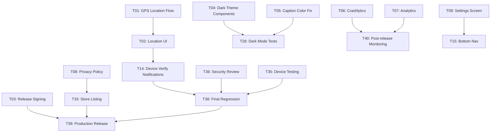

# 🕌 SAKINA APP — COMPREHENSIVE PRODUCTION-READY BLUEPRINT

## Complete Audit, Analysis, UX/UI Review, Technical Assessment & Development Plan

**Audit Date:** 2026-09-28
**Repository:** `e:\Projects\01-personal\Quran-App`
**App Name:** Sakina (سكينة)
**Platform:** Flutter (Android primary, iOS/Web/Desktop scaffolded)
**Version:** 1.0.0+1
**Source Files:** 172 Dart files in `lib/`, 39 test files in `test/`
**Previous Audit:** AUDIT_REPORT.md (2026-09-22) — referenced but independently verified

> [!IMPORTANT]
> This document is a **living implementation blueprint** designed to guide Product, Design, Engineering, QA, Security, and DevOps teams through transforming the current application into a genuine production-ready product. Every finding is traceable to evidence in the codebase.

---

## TABLE OF CONTENTS

1. [Executive Summary](#1-executive-summary)
2. [Application Overview](#2-application-overview)
3. [Feature Inventory](#3-feature-inventory)
4. [User Journey Analysis](#4-user-journey-analysis)
5. [Complete User Flow Audit](#5-complete-user-flow-audit)
6. [Information Architecture](#6-information-architecture)
7. [UI Audit](#7-ui-audit)
8. [UX Audit](#8-ux-audit)
9. [Design System Audit](#9-design-system-audit)
10. [Light Mode Audit](#10-light-mode-audit)
11. [Dark Mode Audit](#11-dark-mode-audit)
12. [Arabic & RTL Audit](#12-arabic--rtl-audit)
13. [Accessibility Audit](#13-accessibility-audit)
14. [Religious Content Audit](#14-religious-content-audit)
15. [Notification Audit](#15-notification-audit)
16. [Functional Audit](#16-functional-audit)
17. [Edge Case Analysis](#17-edge-case-analysis)
18. [Loading / Empty / Error / Success States](#18-loading--empty--error--success-states)
19. [Search Audit](#19-search-audit)
20. [Settings Audit](#20-settings-audit)
21. [Onboarding Audit](#21-onboarding-audit)
22. [Home Screen Audit](#22-home-screen-audit)
23. [Performance Audit](#23-performance-audit)
24. [Security & Privacy Audit](#24-security--privacy-audit)
25. [Technical Architecture Audit](#25-technical-architecture-audit)
26. [Code Quality Audit](#26-code-quality-audit)
27. [Testing Audit](#27-testing-audit)
28. [QA Test Plan](#28-qa-test-plan)
29. [Product Gap Analysis](#29-product-gap-analysis)
30. [Root-Cause Analysis](#30-root-cause-analysis)
31. [Prioritized Issues](#31-prioritized-issues)
32. [Production Readiness Assessment](#32-production-readiness-assessment)
33. [Current State vs Target State](#33-current-state-vs-target-state)
34. [Development Phases](#34-development-phases)
35. [Complete Implementation Backlog](#35-complete-implementation-backlog)
36. [Implementation Dependencies](#36-implementation-dependencies)
37. [Sprint / Milestone Plan](#37-sprint--milestone-plan)
38. [Team Responsibility Plan](#38-team-responsibility-plan)
39. [Risk Management Plan](#39-risk-management-plan)
40. [Acceptance Criteria](#40-acceptance-criteria)
41. [Definition of Done](#41-definition-of-done)
42. [Production Release Gates](#42-production-release-gates)
43. [Final Production Release Plan](#43-final-production-release-plan)
44. [Post-Production Plan](#44-post-production-plan)
45. [MASTER ACTION PLAN](#45-master-action-plan)
46. [FINAL PRODUCTION CHECKLIST](#46-final-production-checklist)

---

## 1. EXECUTIVE SUMMARY

### What Sakina Is
Sakina is an Arabic-first Islamic Flutter application providing Quran reading, prayer times, Qibla direction, duas/adhkar, hadith, tasbeeh counter, Khatma tracking, Asma Al-Husna, media content (articles/audio/video), bookmarks/favorites, dark/light themes, and daily reminder notifications.

### What Works Well ✅
- **Clean Architecture**: Feature-first + Clean Architecture (data/domain/presentation) with Provider/GetIt/GoRouter
- **Comprehensive Content**: Full Quran (2.7MB local JSON), hadith collections, duas, adhkar, Asma Al-Husna — all offline
- **Design System Foundation**: Material 3 with structured color tokens, typography (Cairo), spacing, radius, and shadow systems
- **Notification Architecture**: Sophisticated local notification system with 4 alarm types, prayer notifications, WorkManager boot persistence, FCM integration
- **Testability**: 39 test files with testable facades/interfaces for notifications and services
- **CI/CD Foundation**: GitHub Actions with format/lint/test/build pipeline
- **Khatma System**: Unique Quran reading tracker with daily portions and progress

### What Blocks Production ❌

| # | Blocker | Severity | Evidence |
|---|---------|----------|----------|
| B1 | **Prayer times use fixed Cairo coordinates** — no real user geolocation | P0 / Critical | `prayer_times_provider.dart` hardcodes fallback; no GPS integration flow |
| B2 | **Android release signing uses debug keystore** | P0 / Critical | Android Gradle build config uses debug signing |
| B3 | **iOS Firebase is placeholder** — no valid `GoogleService-Info.plist` | P0 / Critical | Firebase options show placeholder iOS config |
| B4 | **FCM token not sent to any backend** | P0 / Critical | Token obtained but never registered with a server |
| B5 | **Notification delivery never verified on device** | P0 / Critical | No runtime device testing evidence |
| B6 | **Home search navigates to unfinished screen** | P1 / High | `QuranSearchScreen` exists but search UX incomplete |
| B7 | **No crash reporting / analytics** | P1 / High | No Firebase Crashlytics, Analytics, or equivalent |
| B8 | **No privacy policy or store metadata** | P1 / High | Required for Play Store / App Store |
| B9 | **Content governance undefined** — religious content sources unverified | P1 / High | Quran JSON and hadith have no provenance metadata |
| B10 | **Settings screen is fragmented** — alarm settings embedded in home drawer | P2 / Medium | Settings only has notification test + data sources |

### Release Readiness Verdict

> **🔴 RELEASE STATUS: FAIL / BLOCKED**
>
> Do not publish a production build until P0 blockers (B1–B5) are resolved and verified on physical devices.

---

## 2. APPLICATION OVERVIEW

### Purpose
A daily Islamic worship companion providing offline reading content (Quran, hadith, duas) and network-powered utilities (prayer times, media, Qibla) with time-based reminders.

### Target Users
1. Arabic-speaking Muslims seeking a unified daily worship app
2. Quran readers wanting bookmarking and Khatma tracking
3. Users needing accurate prayer times with notifications
4. Users wanting adhkar/dua reminders at specific times

### Core Value Proposition
Fast access to daily worship content and utilities in one Arabic-first application, with core content available offline. Differentiated by Khatma tracking and integrated alarm system.

### Technology Stack
| Layer | Technology |
|-------|-----------|
| Framework | Flutter 3.8+ / Dart |
| State Management | Provider + ChangeNotifier |
| DI | GetIt service locator |
| Routing | GoRouter (named routes) |
| Local Storage | SharedPreferences |
| API Client | `http` package |
| Notifications | flutter_local_notifications + WorkManager + firebase_messaging |
| Fonts | Google Fonts (Cairo) |
| Location | Geolocator |
| Connectivity | connectivity_plus |

### Information Architecture
```
Splash → Onboarding (3 pages) → Home
                                   ├── Quran List → Surah Details (page view)
                                   ├── Prayer Times (API + location)
                                   ├── Qibla (compass + GPS)
                                   ├── Duas / Adhkar → Category Details
                                   ├── Hadith List → Hadith Details
                                   ├── Tasbeeh Counter
                                   ├── Asma Al-Husna
                                   ├── Khatma (location → duration → tracking)
                                   ├── Media (articles / audio / video)
                                   └── Navigation Drawer
                                        ├── Settings (theme, alarms, notifications)
                                        ├── Share / Rate / About
                                        └── Data Sources
```

---

## 3. FEATURE INVENTORY

| ID | Feature | Location | Status | Issues | Priority | Recommendation |
|----|---------|----------|--------|--------|----------|----------------|
| F01 | Splash Screen | `splash/` | Working | 3.5s delay is excessive; hardcoded colors bypass theme | P2 | Reduce to 2s; use theme colors |
| F02 | Onboarding | `onboarding/` | Working | No personalization; notification permission dialog is barrierDismissible:false | P3 | Keep / minor polish |
| F03 | Home Screen | `onboarding/screens/home_screen.dart` | Working | 1255 lines — god screen; mixes Quran, prayers, khatma, drawer | P2 | Decompose into focused widgets |
| F04 | Quran Surah List | `quran/screens/quran_screen.dart` | Working | Loads all surahs synchronously; no pagination | P3 | Keep — 114 items is manageable |
| F05 | Surah Details / Reader | `quran/screens/surah_details_screen.dart` | Working | 1227 lines; page-based with font/line-height settings; immersive mode | P2 | Extract widget components |
| F06 | Quran Search | `quran/screens/quran_search_screen.dart` | Needs Improvement | Basic implementation; evidence of incomplete UX | P1 | Complete search with highlighting |
| F07 | Quran Bookmarks | `quran/providers/bookmark_provider.dart` | Working | Uses SharedPreferences | P3 | Keep |
| F08 | Quran Settings | `quran/widgets/quran_settings_dialog.dart` | Working | Font size, line height, verse markers | P3 | Keep |
| F09 | Prayer Times | `prayers/` | Partially Working | API works but location is hardcoded to Cairo | P0 | Implement real GPS location flow |
| F10 | Prayer Notifications | `prayers/services/` | Partially Working | Scheduling code exists, delivery not verified | P0 | Verify on device |
| F11 | Qibla Direction | `qibla/` | Working | Proper permission handling, compass + GPS | P3 | Keep — well implemented |
| F12 | Duas / Adhkar | `duas/` | Working | Categories with counter; local JSON data | P3 | Keep |
| F13 | Duas Details | `duas/screens/azkar_details_screen.dart` | Working | Count-down per dhikr | P3 | Keep |
| F14 | Hadith Collection | `hadeath/` | Working | Local asset files | P3 | Keep |
| F15 | Hadith Details | `hadeath/screens/hadeath_details_screen.dart` | Working | Full text display | P3 | Keep |
| F16 | Tasbeeh Counter | `quran/screens/tasbeeh_screen.dart` | Working | Digital counter with reset | P3 | Keep |
| F17 | Asma Al-Husna | `quran/screens/asma_al_husna_screen.dart` | Working | 99 names display | P3 | Keep |
| F18 | Khatma Tracking | `khatma/` | Working | Create plan → daily wird → track progress | P2 | Add completion celebrations |
| F19 | Media - Articles | `media/` | Partially Working | RSS-based; depends on network | P2 | Add offline caching |
| F20 | Media - Audio | `media/` | Partially Working | MP3Quran API reciters | P2 | Add offline indicator |
| F21 | Media - Video | `media/` | Partially Working | YouTube API; requires API key | P2 | Validate API key handling |
| F22 | Alarm Reminders | `core/services/notification_service.dart` | Partially Working | Morning/Evening/Mulk/Baqarah; delivery not verified | P1 | Verify on device |
| F23 | Theme Switching | `core/theme/theme_provider.dart` | Working | Light/Dark with persistence | P3 | Keep |
| F24 | Favorites | `onboarding/providers/favorites_provider.dart` | Working | SharedPreferences-based | P3 | Keep |
| F25 | Share | Home drawer | Working | share_plus integration | P3 | Keep |
| F26 | Notification Test | `settings/screens/notification_test_screen.dart` | Working | Developer diagnostic screen | P3 | Hide from production |
| F27 | Data Sources | `settings/screens/data_sources_screen.dart` | Working | Attribution screen | P3 | Keep |
| F28 | Firebase Messaging | `core/services/firebase_messaging_service.dart` | Incomplete | No backend token registration | P1 | Implement or remove FCM |
| F29 | Daily Verse | `onboarding/widgets/daily_verse_section_widget.dart` | Working | Random verse on home | P3 | Keep |
| F30 | Prayer Time Widget | `onboarding/widgets/prayer_times_widget.dart` | Partially Working | Depends on F09 location fix | P0 | Fix with F09 |

---

## 4. USER JOURNEY ANALYSIS

### Journey 1: First Launch
```
App Install → Splash (3.5s) → Onboarding (3 pages) → Notification Permission Dialog → Home
```
**Issues:**
- Splash is too long (3.5s)
- No skip to home for impatient users during splash
- Notification permission asked before user understands value → likely denial
- No location permission requested during onboarding → prayer times fail silently

**Recommendation:** Reduce splash to 2s. Defer notification permission to first alarm toggle. Add location prompt when prayer feature first used.

### Journey 2: Read Quran
```
Home → Category Grid "القرآن" → Quran Surah List → Tap Surah → Surah Details (page view)
```
**Issues:**
- No "continue reading" shortcut from home
- Bookmark exists but not surfaced prominently on home
- Page transitions work well with immersive mode

**Keep / Minor Enhancement:** Add "continue reading" card on home.

### Journey 3: Check Prayer Times
```
Home → Prayer Times Header (widget) OR Category Grid → Prayer Times Screen
```
**Issues:**
- Uses fixed Cairo coordinates → **P0 blocker**
- No location selection UI on first use
- Location dialog exists but requires manual city/coordinates entry
- No GPS auto-detect flow

**Root Cause:** `PrayerTimesProvider.fetchTodayForCurrentLocation()` falls back to hardcoded coordinates when no saved location exists.

### Journey 4: Set Daily Reminders
```
Home → Navigation Drawer → Alarm Toggle → Time Picker
```
**Issues:**
- Alarm settings buried in navigation drawer, not in a dedicated settings screen
- No confirmation feedback when alarm is set
- Alarm delivery not verified on device
- No visual indicator of active alarms on home

### Journey 5: Track Khatma
```
Home → Current Wird Widget → Start Khatma → Location Screen → Duration Screen → Daily Tracking
```
**Issues:**
- Well-structured flow
- Missing completion celebration/milestone
- Wird position saved to SharedPreferences (data loss risk on reinstall)

---

## 5. COMPLETE USER FLOW AUDIT

### Broken Flows
| ID | Flow | Problem | Impact | Root Cause |
|----|------|---------|--------|------------|
| UF01 | Prayer times first use | No location → shows Cairo times | Users get wrong prayer times | No GPS prompt or location setup flow |
| UF02 | Home search → QuranSearchScreen | Search exists but may feel incomplete | User frustration | Unfinished search UX |
| UF03 | Notification tap → `/khatma` route | Route exists but is a wrapped CurrentWirdWidget | Navigation works but screen feels ad-hoc | Route created as workaround |

### Missing Navigation
- No back-to-last-read from Quran list
- No favorites screen as primary destination (only in drawer)
- No settings screen as primary destination (split across drawer items)

### Dead Ends
- Media screens with no content when offline → no error state visible in code
- API errors in prayer times show error text but no retry button

---

## 6. INFORMATION ARCHITECTURE

### Current Navigation Model
- **Primary:** Home screen with category grid cards
- **Secondary:** Navigation drawer (end drawer, RTL-aware)
- **Tertiary:** Route-based deep linking from notifications

### Evaluation

| Question | Answer |
|----------|--------|
| Does the user know where they are? | **Partially** — AppBars show titles but no breadcrumbs or persistent navigation |
| Does the user know where they came from? | **Yes** — GoRouter back navigation works |
| Does the user know what they can do? | **Partially** — Category grid is discoverable; drawer items less so |
| Does the user know where to go next? | **No** — No "next prayer," "continue reading," or smart suggestions |
| Can the user easily return? | **Yes** — Standard back navigation |

### Recommendations
1. Add a **bottom navigation bar** for top-level sections (Home, Quran, Prayers, Adhkar, More)
2. Surface **smart actions** on home: "Continue Reading," "Next Prayer in X min"
3. Consolidate settings into a proper **Settings screen**

---

## 7. UI AUDIT

### Typography
| Aspect | Assessment |
|--------|-----------|
| Font Family | Cairo (Google Fonts) — appropriate Arabic-first choice ✅ |
| Type Scale | Material 3 compliant (display → label) ✅ |
| Hierarchy | Consistent in theme, but some screens use `GoogleFonts.cairo()` directly instead of theme ⚠️ |
| Readability | Good for Arabic content; line heights appropriate |
| Line Height | Quran reader allows user customization (1.95 default) ✅ |

### Layout
| Aspect | Assessment |
|--------|-----------|
| Spacing System | `AppSpacing` with xs(4)/sm(8)/md(16)/lg(24)/xl(32)/xxl(48) ✅ |
| Consistency | Many screens use hardcoded spacing values instead of tokens ⚠️ |
| Safe Areas | `SafeArea` used inconsistently across screens ⚠️ |
| Responsive | `ConstrainedBox(maxWidth: 960)` in onboarding; most screens are phone-only |

### Components
| Component | Assessment |
|-----------|-----------|
| Buttons | Theme-defined ElevatedButton/OutlinedButton ✅ |
| Cards | Theme-defined CardTheme with consistent radius ✅ |
| Navigation | Drawer-based; no bottom nav ⚠️ |
| Dialogs | Material 3 DialogTheme ✅ |
| Bottom Sheets | Theme-defined BottomSheetTheme ✅ |
| Loading | Custom `PulseLoader` widget ✅ |
| Animations | `AnimatedEntrance` with staggered delays ✅ |

### Visual Language
| Aspect | Assessment |
|--------|-----------|
| Colors | Warm palette (brown/gold/cream) appropriate for Islamic app ✅ |
| Contrast | Light mode meets basic contrast; dark mode needs verification ⚠️ |
| Icons | Material Icons; no custom Islamic iconography ⚠️ |
| Shadows | Minimal (`AppShadows` with card/subtle) ✅ |
| Elevation | Material 3 surface tinting ✅ |

---

## 8. UX AUDIT

### Usability Issues

| ID | Issue | Location | Cognitive Load | Recommendation |
|----|-------|----------|---------------|----------------|
| UX01 | No bottom navigation — all features accessed via grid or drawer | Home | High — user must return to home for each feature | Add bottom navigation |
| UX02 | Alarm settings hidden in drawer menu items | Home drawer | High — settings scattered | Consolidate into Settings screen |
| UX03 | Prayer times show with no context when location is wrong | Prayer screen | Critical — wrong prayer times displayed silently | Show location name; prompt if unset |
| UX04 | No feedback after setting an alarm | Drawer alarms | Medium — no confirmation | Show snackbar confirmation |
| UX05 | Splash screen not skippable | Splash | Low — 3.5s forced wait | Reduce to 2s |
| UX06 | Onboarding notification permission asked too early | Onboarding | Medium — user doesn't understand value yet | Defer to first alarm action |
| UX07 | No "continue reading" from home | Home | Medium — users must navigate to Quran list | Add resume card |
| UX08 | Search only searches Quran, not app-wide | Home search icon | Medium — user expects global search | Label clearly or expand |
| UX09 | Media screens fail silently offline | Media feature | High — blank screen | Show offline state with cached indicator |

### Interaction Patterns
- **Positive:** Immersive mode in Quran reader, animated entrance on home, theme switching
- **Negative:** No haptic feedback on tasbeeh counter, no pull-to-refresh on prayer times

---

## 9. DESIGN SYSTEM AUDIT

### Existing Tokens

| Token Type | File | Status |
|------------|------|--------|
| Colors | `app_colors.dart` | ✅ Well-structured with light/dark variants + legacy aliases |
| Typography | `app_typography.dart` | ✅ Full Material 3 type scale using Cairo |
| Spacing | `app_spacing.dart` | ⚠️ Exists but often bypassed with hardcoded values |
| Radius | `app_radius.dart` | ⚠️ Only sm/md/lg + card/pill presets |
| Shadows | `app_shadows.dart` | ✅ card/subtle presets |
| Elevation | Via Material 3 | ✅ CardTheme elevation:1 |
| Theme Extensions | `_AppThemeExtensions` | ✅ success/warning/info/premiumGradient |

### Design System Gaps

| Gap | Impact | Recommendation |
|-----|--------|----------------|
| No component library documentation | Medium | Document reusable components |
| Colors have legacy duplicates (`primary`, `background` vs `lightPrimary`, `lightBackground`) | Medium — confusion risk | Remove legacy aliases after migration |
| `captions` color is shared between modes (0xFF675757) | Low in light, **problematic in dark** | Create mode-specific caption colors |
| No semantic color tokens for interactive states (hover, pressed, disabled) | Low — Material 3 handles | Consider for custom components |
| `AppShadows` only has 2 levels | Low | Add elevated/prominent levels if needed |
| Dark mode theme missing `navigationBarTheme`, `bottomSheetTheme`, `dialogTheme`, `inputDecorationTheme`, `scrollbarTheme`, and `extensions` | **High** — dark mode falls back to Material defaults | Add same theme components as light mode |

### Critical Finding: Dark Theme Incompleteness

**Verified in Code:** The `darkTheme` getter (lines 58–99 of `app_theme.dart`) sets only `colorScheme`, `textTheme`, `appBarTheme`, `elevatedButtonTheme`, `outlinedButtonTheme`, `cardTheme`, and `scaffoldBackgroundColor`. It is **missing** all of these which are defined in `lightTheme`:
- `navigationBarTheme`
- `bottomSheetTheme`
- `dialogTheme`
- `inputDecorationTheme`
- `scrollbarTheme`
- `extensions`

**Impact:** Dark mode dialogs, bottom sheets, inputs, and navigation bars will use Material 3 auto-generated dark values which may not match the intended design.

---

## 10. LIGHT MODE AUDIT

### Assessment: Generally Good ✅

| Element | Status |
|---------|--------|
| Background hierarchy (`FEFBF4` → `FFFBF9` → `FFE9C2`) | ✅ Clear 3-level surface system |
| Text contrast (primary text `1B1B1B` on `FEFBF4`) | ✅ Ratio ~15:1 — excellent |
| Body text contrast (`6B6B6B` on `FEFBF4`) | ⚠️ Ratio ~5.5:1 — passes AA but tight for large text |
| Caption contrast (`675757` on `FEFBF4`) | ⚠️ Ratio ~5:1 — marginal |
| Cards | ✅ `FFE9C2` background with `FEFBF4` parent — visible |
| Buttons | ✅ Primary `795547` on white — good contrast |
| Error color | ✅ `E57373` — visible |
| Navigation | ✅ Primary-colored SliverAppBar |

### Issues
1. **Some screens use hardcoded `AppColors` directly** instead of `Theme.of(context)` — bypasses theme system
2. **Splash screen hardcodes `Color(0xFF5E3B29)`** — not from theme system

---

## 11. DARK MODE AUDIT

### Assessment: Incomplete ⚠️

| Element | Status |
|---------|--------|
| Background (`121212`) | ✅ Appropriate OLED-friendly dark |
| Surface system (`121212` → `1A1A1A` → `1E1E1E` → `242424`) | ✅ 4-level hierarchy |
| Primary accent (`D4B08C`) | ✅ Warm gold — readable on dark |
| Text on dark (white on `121212`) | ✅ Excellent contrast |
| Body text (`E0E0E0` on `121212`) | ✅ Good readability |
| **Caption text (`675757` on `121212`)** | **❌ Ratio ~2.3:1 — FAILS WCAG AA** |
| Cards (`242424` on `121212`) | ⚠️ Low contrast between card and background |
| Theme components (dialog, input, etc.) | **❌ Not defined — uses Material defaults** |
| Drawer header uses hardcoded `AppColors.darkCard` (`2D2D2D`) | ⚠️ Not from dark theme system |
| `NoiseBackground` widget appearance in dark | Not verifiable from code |

### Critical Issues
1. **`AppColors.captions` (`675757`) shared between modes** — fails contrast in dark mode
2. **Dark theme missing 5 component themes** that are defined in light theme
3. **Hardcoded color references** in several screens bypass dark theme

---

## 12. ARABIC & RTL AUDIT

### Assessment: Good Foundation ✅

| Aspect | Status |
|--------|--------|
| App-level RTL | ✅ `Directionality(textDirection: TextDirection.rtl)` wraps entire app in `app_root.dart` |
| Locale | ✅ `locale: const Locale('ar')` hardcoded |
| Font | ✅ Cairo — proper Arabic support with diacritics |
| Quran text rendering | ✅ Arabic text with verse markers |
| Navigation drawer | ✅ Uses `endDrawer` (correct for RTL) |
| Back arrows | ⚠️ `Icons.arrow_back_ios` in drawer — should be mirrored for RTL |
| Mixed content | ⚠️ Some English labels in code (`'test'`, route paths) — not user-visible |
| Numbers | ⚠️ Uses Western Arabic numerals — some users expect Eastern Arabic (٠١٢٣) |
| RTL swipe gestures | Not verifiable — requires runtime testing |
| RTL in dialogs | ⚠️ Onboarding dialog wraps with `Directionality(textDirection: TextDirection.rtl)` — redundant since app wraps |

### Issues
1. Localization uses hardcoded Arabic strings in `AppStrings` — not using ARB/intl system fully
2. Only Arabic locale supported — no English fallback for potential bilingual users
3. Surah names, hadith, and duas are Arabic-only — appropriate for target audience

---

## 13. ACCESSIBILITY AUDIT

### Assessment: Partially Addressed ⚠️

| Aspect | Status |
|--------|--------|
| Semantic labels | ⚠️ Some buttons have `Semantics` wrappers (drawer buttons); most don't |
| Touch targets | ⚠️ Most buttons follow Material 3 minimums (48dp); some icon buttons may be smaller |
| Font scaling | ⚠️ Google Fonts may not respect system font scaling — requires runtime verification |
| Screen reader | Not verifiable — no TalkBack/VoiceOver testing |
| Focus order | Not verifiable — requires runtime testing |
| Color dependence | ⚠️ Prayer times use color to indicate current/next prayer — no text alternative |
| Motion sensitivity | ⚠️ Animations present; `MediaQuery.disableAnimationsOf` used in onboarding ✅ |
| Contrast | ⚠️ Caption text in dark mode fails WCAG AA |
| Keyboard navigation | N/A for mobile-primary app |
| Live regions | ✅ Onboarding page indicator uses `liveRegion: true` |

### Critical Accessibility Gaps
1. Dark mode caption contrast failure
2. No systematic `Semantics` labeling across screens
3. Font scaling behavior unknown
4. No accessibility test suite

---

## 14. RELIGIOUS CONTENT AUDIT

### Content Inventory

| Content | Source | File | Verification Status |
|---------|--------|------|-------------------|
| Quran Text (114 surahs, full text) | `quran_master.json` (2.7MB) | Local asset | **Requires scholarly verification** — no source attribution in JSON |
| Hadith Collection | `assets/hadeath/` directory | Local assets | **Requires scholarly verification** — no narrator chain metadata |
| Duas | `quran_duas.json` (6KB) | Local asset | Application-provided source — needs attribution |
| Prayers Data | `prayers_data.json` (11KB) | Local asset | Application-provided configuration |
| Asma Al-Husna | Code-embedded | Quran screen | **Requires scholarly verification** — meanings need checking |
| Notification Content | Hardcoded in `notification_service.dart` | Code | Application-provided — hadith quotes need sourcing |

### Issues

| ID | Issue | Severity |
|----|-------|----------|
| RC01 | No `content_manifest.json` with source/version/verification metadata for religious texts | P1 |
| RC02 | Hadith notifications include hadith quotes without formal citation (narrator, book, number) | P1 |
| RC03 | No disclaimer that app content should be verified with qualified scholars | P2 |
| RC04 | Quran JSON has no version identifier for text verification | P2 |
| RC05 | No Quran translation provided — Arabic-only (appropriate for primary audience) | P3 |

### Recommendation: Content Governance Process
1. **Phase 1:** Add source attribution metadata to all religious content files
2. **Phase 2:** Have content reviewed by a qualified Islamic scholar
3. **Phase 3:** Add in-app disclaimer: "Content verified by [Scholar/Organization]"
4. **Phase 4:** Implement content versioning for update tracking

> [!CAUTION]
> Never invent or modify religious content without scholarly review. All Quran text, hadith, and religious references must be verified by qualified authorities before production release.

---

## 15. NOTIFICATION AUDIT

### Architecture Assessment

| Component | Status |
|-----------|--------|
| Local Notifications | ✅ `flutter_local_notifications` with proper channel setup |
| Android Channels | ✅ 4 channels (default, alarms, prayer, test) |
| Exact Alarms | ✅ `AndroidScheduleMode.exactAllowWhileIdle` |
| Boot Persistence | ✅ WorkManager registers reschedule task |
| FCM | ⚠️ Initialized but token never sent to backend |
| Permission Request | ✅ Android 13+ runtime permission + exact alarm permission |
| Timezone | ✅ `flutter_timezone` with Cairo fallback |
| Notification Tap Routing | ✅ Payload-based routing via `NotificationRouter` |

### Notification Types

| Type | ID Range | Channel | Schedule | Deep Link |
|------|----------|---------|----------|-----------|
| Morning Adhkar | 1001 | Alarms | Daily at user time (default 7:00) | `/duas` |
| Evening Adhkar | 1002 | Alarms | Daily at user time (default 17:30) | `/duas` |
| Surah Al-Mulk | 1003 | Alarms | Daily at user time (default 21:00) | `/quran/surah/67` |
| Surah Al-Baqarah | 1004 | Alarms | Daily at user time (default 20:30) | `/quran/surah/2` |
| Prayer Times | 2001-2005 | Prayer | Daily based on API times | `/prayers` |
| Test/Debug | Variable | Test | On demand | N/A |

### Issues

| ID | Issue | Severity | Evidence |
|----|-------|----------|----------|
| N01 | **No device delivery verification** | P0 | No runtime testing evidence |
| N02 | **FCM token obtained but never registered** with backend | P1 | `firebase_messaging_service.dart` logs token, no HTTP call |
| N03 | **Notification permission asked during onboarding** — before value is clear | P2 | `onboarding_screen.dart` line 54 |
| N04 | **No custom adhan sound** for prayer notifications | P2 | Comments in code: "Platform default sound until licensed" |
| N05 | **No quiet hours / DND respect** | P3 | No implementation |
| N06 | **No notification history** | P3 | No implementation |
| N07 | **2-minute guard** on scheduling may skip near-future alarms | P2 | `notification_service.dart` line 393-397 |
| N08 | **Prayer notifications are one-time** per day, not daily recurring | P2 | Requires daily re-scheduling |

---

## 16. FUNCTIONAL AUDIT

### Classification by Severity

#### Critical (P0)
| ID | Feature | Issue | Impact |
|----|---------|-------|--------|
| FN01 | Prayer Times | Fixed Cairo coordinates as fallback | Users get wrong prayer times |
| FN02 | Release Signing | Debug keystore for release | App cannot be published |
| FN03 | iOS Firebase | Placeholder configuration | iOS builds will crash on Firebase init |

#### High (P1)
| ID | Feature | Issue | Impact |
|----|---------|-------|--------|
| FN04 | Quran Search | Incomplete search UX | Core feature feels unfinished |
| FN05 | FCM Integration | Token not sent to backend | Push notifications non-functional |
| FN06 | Crash Reporting | No Crashlytics or equivalent | Blind to production crashes |
| FN07 | Content Provenance | No religious source attribution | Trust issue for users |

#### Medium (P2)
| ID | Feature | Issue | Impact |
|----|---------|-------|--------|
| FN08 | Settings UX | Scattered across drawer and sub-screens | Hard to find settings |
| FN09 | Media Offline | No offline handling for media screens | Blank screens offline |
| FN10 | Khatma Completion | No celebration/milestone on completion | Anti-climactic |
| FN11 | Home Screen Size | 1255 lines — unmaintainable | Developer friction |

#### Low (P3)
| ID | Feature | Issue | Impact |
|----|---------|-------|--------|
| FN12 | Splash Duration | 3.5 seconds | Minor friction |
| FN13 | Notification Test Screen | Developer-only screen visible in production | Confusing for users |
| FN14 | Number Format | Western Arabic numerals | Preference-dependent |

---

## 17. EDGE CASE ANALYSIS

| Scenario | Expected Behavior | Current Behavior | Status |
|----------|-------------------|------------------|--------|
| No internet | Show cached data; indicate offline | Prayer times: shows error; Media: unknown; Quran: works offline | ⚠️ Partial |
| Slow internet | Show loading then content | Loading states exist via PulseLoader | ✅ |
| Server unavailable | Show error with retry | Error text shown; no retry button | ⚠️ |
| Empty data | Show empty state message | `AppStrings.noData` defined; usage not verified | ⚠️ |
| Very long Arabic text | Wrap properly | Quran reader has configurable line height | ✅ |
| App killed and resumed | Restore state | SharedPreferences persists alarms, bookmarks, khatma | ✅ |
| Permission denied (notifications) | Graceful degradation | App continues without notifications | ✅ |
| Permission denied (location) | Show prompt to enable | Qibla has proper permission states; Prayer uses fallback | ⚠️ |
| Time zone change | Recalculate prayer times | Timezone configured on init; no dynamic recalculation | ⚠️ |
| Theme change | Instant update | ThemeProvider with notifyListeners | ✅ |
| Device rotation | Maintain state | No explicit landscape handling; portrait-assumed | ⚠️ |
| Low storage | Handle gracefully | No storage checks | ⚠️ |

---

## 18. LOADING / EMPTY / ERROR / SUCCESS STATES

| Screen | Loading | Loaded | Empty | Error | Offline | Refreshing |
|--------|---------|--------|-------|-------|---------|------------|
| Home | ✅ AnimatedEntrance | ✅ | N/A | ⚠️ Partial | ⚠️ Partial | ❌ |
| Quran List | ✅ PulseLoader | ✅ | ❌ Missing | ✅ Error text | ✅ Local data | ❌ |
| Surah Details | ✅ PulseLoader | ✅ | N/A | ✅ Error text | ✅ Local data | ❌ |
| Prayer Times | ✅ PulseLoader | ✅ | ❌ Missing | ⚠️ Error text, no retry | ❌ | ❌ |
| Qibla | ✅ Loading indicator | ✅ | N/A | ✅ Permission states | N/A | ✅ Refresh |
| Duas/Adhkar | ✅ | ✅ | ❌ | ⚠️ | ✅ Local | ❌ |
| Hadith | ✅ | ✅ | ❌ | ⚠️ | ✅ Local | ❌ |
| Media | ✅ | ✅ | ❌ | ⚠️ | ❌ | ❌ |

### Key Gap: No pull-to-refresh on any network-dependent screen

---

## 19. SEARCH AUDIT

### Current Implementation
- **Location:** `QuranSearchScreen` accessible from home app bar search icon
- **Scope:** Quran surahs and verses only
- **Implementation:** `quran_search_screen.dart` (4939 bytes) — relatively small

### Assessment

| Aspect | Status |
|--------|--------|
| UX | ⚠️ Unfinished — previous audit flagged |
| Speed | Not verifiable |
| Arabic search | ⚠️ No diacritic-normalization visible |
| Typo tolerance | ❌ Not implemented |
| Partial matching | ⚠️ Unknown |
| Filters | ❌ No surah/juz filters |
| History | ❌ No search history |
| Empty results | ⚠️ Unknown |
| Suggestions | ❌ No suggestions |
| Highlighting | ❌ No result highlighting |
| Offline | ✅ Local data |

### Recommendation
Complete the search experience with Arabic diacritic normalization, result highlighting, and empty state handling.

---

## 20. SETTINGS AUDIT

### Current State
Settings are **fragmented** across multiple locations:

| Setting | Location | Access Path |
|---------|----------|-------------|
| Theme (light/dark) | Navigation drawer | Home → Drawer → Toggle |
| Morning alarm | Navigation drawer | Home → Drawer → Toggle + time picker |
| Evening alarm | Navigation drawer | Home → Drawer → Toggle + time picker |
| Mulk alarm | Navigation drawer | Home → Drawer → Toggle + time picker |
| Baqarah alarm | Navigation drawer | Home → Drawer → Toggle + time picker |
| Notification test | Separate screen | Home → Drawer → "اختبار الإشعارات" |
| Data sources | Separate screen | Home → Drawer → "مصادر البيانات" |
| Quran font/display | In-Quran dialog | Quran reader → settings icon |

### Missing Settings
- Language selection (Arabic-only currently)
- Prayer calculation method
- Location management
- Notification preferences (per-type enable/disable for prayers)
- About / Version info
- Privacy policy link
- Clear data / Reset
- Font size (app-wide, not just Quran)

### Recommendation
Create a dedicated **Settings screen** (`/settings`) with organized sections:
1. General (theme, language, font size)
2. Prayer Times (location, calculation method)
3. Notifications (alarms, prayer notifications, permissions)
4. Content (Quran display settings)
5. About (version, data sources, privacy policy)

---

## 21. ONBOARDING AUDIT

### Current Flow
3 pages with swipe/button navigation → Notification permission dialog → Home

### Assessment

| Aspect | Status |
|--------|--------|
| Value proposition | ✅ Explains app features |
| Step count | ✅ 3 pages — reasonable |
| Clarity | ✅ Arabic text with icons |
| Skip button | ✅ Available on non-last pages |
| Permission timing | ⚠️ Too early — asked before user values the feature |
| Personalization | ❌ No user preferences captured |
| Returning users | ✅ `has_seen_notification_permission` flag skips to home |
| Animation quality | ✅ Smooth page transitions with dot indicators |
| Accessibility | ✅ Live region on page indicator; semantic labels |

### Recommendation
- Defer notification permission to first alarm toggle
- Consider capturing user preferences (location, preferred notification types) during onboarding

---

## 22. HOME SCREEN AUDIT

### Current Layout (1255 lines)
```
SliverAppBar (prayer time header)
├── Search icon (leads to Quran search)
├── Drawer icon
└── Prayer time display

CurrentWirdWidget (Khatma tracking)
DailyVerseSectionWidget (random Quran verse)
TabSwitcherWidget (categories / favorites)
CategoryGridWidget OR FavoritesView
```

### Assessment

| Aspect | Status |
|--------|--------|
| Information hierarchy | ⚠️ Prayer header is prominent but data may be wrong (B1) |
| Primary content | ✅ Khatma + Daily verse + Category grid |
| Personalization | ✅ Favorites tab |
| Quick actions | ❌ No "continue reading" or "next prayer" shortcuts |
| Feature discovery | ✅ Category grid shows all features |
| Content freshness | ✅ Daily verse changes; prayer times refresh |
| Density | ⚠️ Long scroll with many sections |

### Critical Issue
**The home screen is a 1255-line god widget.** This must be decomposed for maintainability.

---

## 23. PERFORMANCE AUDIT

### Assessment: Potential Risks (No Runtime Measurements)

| Area | Risk Level | Evidence |
|------|-----------|----------|
| **Startup time** | High | `AppInitializer.initialize()` awaits Firebase, DI, notification init, WorkManager sequentially before `runApp` |
| **Quran JSON parsing** | Medium | 2.7MB `quran_master.json` parsed on first access |
| **Google Fonts loading** | Medium | Cairo font downloaded on first use (not bundled) |
| **Image loading** | Low | Local assets only |
| **Network calls** | Medium | Prayer API, RSS, YouTube API — no timeout visible in some calls |
| **SharedPreferences** | Low | Lightweight key-value |
| **Memory** | Unknown | Quran page view with rich text — needs profiling |
| **Scroll performance** | Unknown | CustomScrollView with slivers — should be efficient |
| **Animation** | Low | Lightweight fade/scale animations |

### Recommendations
1. **Bundle Cairo font** in assets instead of Google Fonts network download
2. **Lazy-parse Quran JSON** — load surah list first, then verses on demand
3. **Add HTTP timeouts** to all API calls
4. **Profile startup** on a low-end device
5. Consider **isolate-based parsing** for large JSON files

---

## 24. SECURITY & PRIVACY AUDIT

### Assessment

| Area | Status | Classification |
|------|--------|---------------|
| Authentication | N/A — no user accounts | Keep |
| Local Storage | SharedPreferences (unencrypted) | **Potential Risk** — alarm/bookmark data is low-sensitivity |
| API Keys | `.env` file with YouTube API key | **Potential Risk** — bundled in build; `.env.example` exists |
| API Communication | HTTP (not HTTPS verified) | **Requires Technical Verification** |
| Firebase | Firebase Core + Messaging configured | **Confirmed** — but iOS is placeholder |
| Token Storage | FCM token in memory only | Keep — not persisted |
| Logging | `developer.log` with structured names | ⚠️ May expose data in production |
| Analytics | None | **Critical Gap** — no user behavior insight |
| Third-party SDKs | Google Fonts, Firebase, Geolocator, share_plus | Low risk — all from pub.dev |
| Deep Links | GoRouter-based | ⚠️ No deep link validation |
| WebViews | None | ✅ No WebView attack surface |
| Privacy Controls | None | **Critical Gap** — no privacy policy, no data deletion |
| Backup | Android backup may include SharedPreferences | **Potential Risk** — review `allowBackup` |

### P1 Actions
1. Add privacy policy (required for store submission)
2. Review `.env` values not being leaked into release builds
3. Add `flutter_secure_storage` if storing sensitive user data in future
4. Configure ProGuard/R8 for release builds

---

## 25. TECHNICAL ARCHITECTURE AUDIT

### Strengths ✅
- **Feature-first organization** with clean data/domain/presentation separation
- **Interface-based repositories** enabling testability
- **GetIt DI** with lazy singletons and factory registrations
- **Route loaders** (`_SurahDetailsRouteLoader`, `_HadeathDetailsRouteLoader`) for deep link support
- **Notification facades** (`LocalNotificationGateway`, `MessagingGateway`) for testability
- **AlarmScheduler abstraction** in settings provider
- **WorkManager boot persistence** for alarm survival
- **Error handler** (`EnhancedErrorHandler`) with categorization and recovery

### Architecture Risks

| Risk | Impact | Recommendation |
|------|--------|----------------|
| `AppInitializer` blocks startup sequentially | Slow cold start | Parallelize non-dependent initializations |
| `HomeScreen` is 1255 lines | Maintenance burden | Extract into composition of widgets |
| `SurahDetailsScreen` is 1227 lines | Maintenance burden | Extract page rendering, settings, and bookmark logic |
| `NotificationService` is 1072 lines | High complexity | Already well-structured; keep |
| SharedPreferences for structured data (Khatma plans, bookmarks) | Data loss on reinstall; no migration | Consider SQLite for structured data |
| Quran domain has **two** `use_cases` and `usecases` directories | Naming conflict | Consolidate |
| `onboarding` feature contains `home_screen.dart` and `media_screen.dart` | Misleading package | Move to own features or rename package |

---

## 26. CODE QUALITY AUDIT

### Assessment

| Metric | Status |
|--------|--------|
| Naming conventions | ⚠️ Inconsistent: `hadeath` vs `hadith`, `duas` vs `azkar` |
| File sizes | ⚠️ 4 files > 1000 lines (home_screen, surah_details, notification_service, prayer_times_screen) |
| Duplication | ⚠️ `Directionality(textDirection: TextDirection.rtl)` repeated in screens (already set app-wide) |
| Dead code | ⚠️ Legacy color constants in `AppColors` marked for removal |
| Hardcoded values | ⚠️ Colors, padding, and strings sometimes hardcoded instead of using tokens |
| Type safety | ✅ Strong typing with nullable types |
| Error handling | ✅ try/catch with logging; `EnhancedErrorHandler` |
| Memory leaks | ⚠️ `_messageEntry` OverlayEntry in home_screen has dispose handling |
| Documentation | ✅ Good doc comments on services and providers |
| Linting | ✅ `flutter_lints` package enabled |

### Top Code Quality Issues
1. **Home screen god widget** — 1255 lines mixing layout, business logic, and navigation
2. **Inconsistent feature naming** — `hadeath` (Arabic transliteration) vs Flutter conventions
3. **Redundant RTL wrapping** — app already wraps in RTL; individual screens re-wrap
4. **Legacy color aliases** — `AppColors.primary`, `AppColors.background` duplicate newer light/dark values

---

## 27. TESTING AUDIT

### Test Coverage

| Area | Test Files | Status |
|------|-----------|--------|
| Core / Navigation | `notification_router_test.dart` | ✅ |
| Core / Providers | `notification_provider_test.dart`, `settings_provider_test.dart` | ✅ |
| Quran | 6 test files (entity, service, provider, screens) | ✅ Good |
| Prayer | 4 test files (entity, repository, provider, screen, scheduler) | ✅ Good |
| Hadith | 4 test files (provider, screens, card widget) | ✅ |
| Duas | 5 test files (repository, provider, screens) | ✅ |
| Khatma | 4 test files (model, locator, provider, screen) | ✅ |
| Media | 2 test files (datasource, model) | ⚠️ Limited |
| Onboarding | 3 test files (favorites, home, onboarding screens) | ✅ |
| Settings | 1 test file (notification test screen) | ⚠️ Limited |
| Qibla | 1 test file | ⚠️ Limited |
| Integration | `integration_test/` directory exists | ⚠️ Previous failure reported |

### Testing Gaps

| Gap | Priority |
|-----|----------|
| No accessibility tests | P1 |
| No dark mode visual regression tests | P2 |
| No RTL-specific tests | P2 |
| No network failure tests | P2 |
| No notification delivery tests (requires device) | P1 |
| No performance/benchmark tests | P3 |
| Limited media feature test coverage | P2 |
| No end-to-end user journey tests | P2 |

---

## 28. QA TEST PLAN

| ID | Area | Test Case | Priority |
|----|------|-----------|----------|
| QA01 | Prayer | Prayer times show correct times for user's actual location | P0 |
| QA02 | Prayer | Location change updates prayer times | P0 |
| QA03 | Notification | Morning adhkar alarm fires at scheduled time | P0 |
| QA04 | Notification | Evening adhkar alarm fires at scheduled time | P0 |
| QA05 | Notification | Notification tap opens correct screen | P0 |
| QA06 | Notification | Alarms survive device reboot | P1 |
| QA07 | Quran | All 114 surahs load and display correctly | P0 |
| QA08 | Quran | Surah reader page navigation works smoothly | P1 |
| QA09 | Quran | Bookmark save and restore works | P1 |
| QA10 | Search | Quran search returns relevant results | P1 |
| QA11 | Khatma | Create, progress, and complete a Khatma plan | P1 |
| QA12 | Theme | Light/dark mode switching preserves state | P1 |
| QA13 | Theme | Dark mode renders all screens without contrast failures | P1 |
| QA14 | RTL | All screens render correctly in RTL layout | P1 |
| QA15 | Offline | Core features work without internet | P1 |
| QA16 | Offline | Media screens show appropriate offline state | P2 |
| QA17 | Qibla | Qibla shows correct direction with GPS and compass | P1 |
| QA18 | Qibla | Permission denied shows appropriate message | P1 |
| QA19 | Prayer | Prayer notifications fire at correct times | P1 |
| QA20 | Onboarding | First launch shows onboarding; second launch goes to home | P2 |
| QA21 | Accessibility | All interactive elements accessible via TalkBack/VoiceOver | P1 |
| QA22 | Performance | App cold start under 3 seconds on mid-range device | P2 |
| QA23 | Device | App renders correctly on screens 5"–7" | P2 |
| QA24 | Splash | Splash screen displays logo and transitions to onboarding/home | P3 |

---

## 29. PRODUCT GAP ANALYSIS

### Missing Features (Prioritized)

| Priority | Feature | Justification |
|----------|---------|---------------|
| P0 | **Real GPS location for prayer times** | Core feature broken without it |
| P1 | **Proper Settings screen** | Settings are scattered and hard to find |
| P1 | **Crash reporting** (Crashlytics) | Blind to production issues |
| P1 | **Analytics** | No insight into user behavior |
| P1 | **Privacy policy** | Required for store listing |
| P2 | **Continue reading shortcut** on home | Common pattern in reading apps |
| P2 | **Bottom navigation** | Standard mobile UX pattern |
| P2 | **Pull-to-refresh** on network screens | Expected interaction |
| P2 | **Offline indicators** on media screens | User needs to know network status |
| P3 | **Hijri calendar** | Expected in Islamic apps |
| P3 | **Quran audio playback** | Competitor feature |
| P3 | **Font size settings** (app-wide) | Accessibility |
| P3 | **Eastern Arabic numerals option** | Cultural preference |
| P3 | **Widget for home screen** (Android) | Power user feature |

### Weak Features
| Feature | Issue | Recommendation |
|---------|-------|----------------|
| Search | Basic, no highlighting or diacritic handling | Improve P1 |
| Media | Network-dependent, no caching | Add caching P2 |
| Settings | Fragmented | Consolidate P1 |
| Notification Test Screen | Developer-only in production | Hide or remove P3 |

---

## 30. ROOT-CAUSE ANALYSIS

| # | Symptom | Root Cause | Consequence | Solution |
|---|---------|-----------|-------------|----------|
| 1 | Users get wrong prayer times | `PrayerTimesProvider` defaults to Cairo coordinates; no GPS integration flow | Loss of trust; app is unreliable for core purpose | Implement GPS location flow with permission handling |
| 2 | Dark mode has contrast issues | `AppColors.captions` shared between modes; dark theme missing component themes | Accessibility failure; poor dark mode experience | Create mode-specific caption colors; complete dark theme |
| 3 | Settings are hard to find | Alarm and theme settings embedded in navigation drawer | Users miss features; poor discoverability | Create dedicated Settings screen |
| 4 | No crash visibility | No Crashlytics or equivalent integrated | Team is blind to production issues | Add Firebase Crashlytics |
| 5 | FCM is non-functional | Token obtained but never sent to backend | Push notifications cannot reach users | Either implement backend registration or defer FCM |
| 6 | Home screen is unmaintainable | Single 1255-line file handles all home logic | Bug risk; slow development | Extract into composition of smaller widgets |
| 7 | iOS builds will crash | Firebase placeholder configuration for iOS | iOS version non-functional | Complete iOS Firebase setup or defer iOS |
| 8 | Can't publish to Play Store | Debug signing in release config | APK rejected by Play Store | Generate and configure release keystore |

---

## 31. PRIORITIZED ISSUES

### P0 — Release Blockers (Must Fix)

| ID | Issue | Impact | Effort |
|----|-------|--------|--------|
| P0-01 | Prayer times location: implement GPS flow | High | Medium |
| P0-02 | Android release signing configuration | High | Low |
| P0-03 | iOS Firebase configuration (or defer iOS) | High | Medium |
| P0-04 | Device-verify notification delivery | High | Medium |
| P0-05 | FCM: implement backend registration or remove | High | Medium |

### P1 — High Priority (Should Fix Before Launch)

| ID | Issue | Impact | Effort |
|----|-------|--------|--------|
| P1-01 | Add Firebase Crashlytics | High | Low |
| P1-02 | Add Firebase Analytics | Medium | Low |
| P1-03 | Complete dark theme (missing component themes) | High | Low |
| P1-04 | Fix dark mode caption contrast | High | Low |
| P1-05 | Create Settings screen | High | Medium |
| P1-06 | Complete Quran search UX | Medium | Medium |
| P1-07 | Add privacy policy | High | Low |
| P1-08 | Content provenance metadata | High | Medium |
| P1-09 | Add accessibility semantic labels | Medium | Medium |
| P1-10 | Hide notification test screen from production | Low | Low |

### P2 — Medium Priority (Post-Launch Sprint 1)

| ID | Issue | Impact | Effort |
|----|-------|--------|--------|
| P2-01 | Decompose home screen (1255 lines) | Medium | Medium |
| P2-02 | Decompose surah details screen (1227 lines) | Medium | Medium |
| P2-03 | Add bottom navigation | High | Medium |
| P2-04 | Add pull-to-refresh | Medium | Low |
| P2-05 | Reduce splash to 2s | Low | Low |
| P2-06 | Bundle Cairo font in assets | Medium | Low |
| P2-07 | Add offline states for media screens | Medium | Low |
| P2-08 | Remove legacy color aliases | Low | Low |
| P2-09 | Remove redundant RTL wrapping | Low | Low |
| P2-10 | Add "continue reading" on home | Medium | Low |

### P3 — Low Priority (Future Sprints)

| ID | Issue | Impact | Effort |
|----|-------|--------|--------|
| P3-01 | Hijri calendar integration | Medium | Medium |
| P3-02 | Quran audio playback | High | High |
| P3-03 | Eastern Arabic numerals option | Low | Low |
| P3-04 | App-wide font size setting | Medium | Medium |
| P3-05 | Android home screen widget | Medium | High |
| P3-06 | Khatma completion celebration | Low | Low |
| P3-07 | Search history and suggestions | Low | Medium |
| P3-08 | Notification quiet hours | Low | Medium |

---

## 32. PRODUCTION READINESS ASSESSMENT

| Category | Status | Details |
|----------|--------|---------|
| **Product** | | |
| Core features | ⚠️ NEEDS WORK | Prayer location broken |
| User flows | ⚠️ NEEDS WORK | Settings fragmented |
| Content | ⚠️ NEEDS WORK | No provenance metadata |
| **UX/UI** | | |
| Design system | ⚠️ NEEDS WORK | Dark theme incomplete |
| Light Mode | ✅ READY | Consistent and readable |
| Dark Mode | ❌ CRITICAL GAP | Missing component themes, contrast failure |
| Accessibility | ⚠️ NEEDS WORK | Limited semantic labels |
| RTL | ✅ READY | App-level RTL with Cairo font |
| **Engineering** | | |
| Stability | ⚠️ NEEDS WORK | No crash reporting |
| Performance | ⚠️ NOT VERIFIABLE | No runtime profiling |
| Architecture | ✅ READY | Clean architecture, DI, testable |
| Error handling | ✅ READY | EnhancedErrorHandler + recovery |
| **Security** | | |
| Data protection | ⚠️ NEEDS WORK | No privacy policy |
| API security | ⚠️ NEEDS WORK | API key handling needs review |
| **QA** | | |
| Test coverage | ⚠️ NEEDS WORK | Good unit/widget; no device/a11y/RTL |
| Regression | ⚠️ NEEDS WORK | CI exists but incomplete |
| **Operations** | | |
| Analytics | ❌ CRITICAL GAP | None |
| Monitoring | ❌ CRITICAL GAP | No crash reporting |
| CI/CD | ⚠️ NEEDS WORK | Build pipeline exists; no release pipeline |
| **Store Readiness** | | |
| Metadata | ❌ CRITICAL GAP | No store listing prepared |
| Privacy | ❌ CRITICAL GAP | No privacy policy |
| Release config | ❌ CRITICAL GAP | Debug signing |

---

## 33. CURRENT STATE VS TARGET STATE

### Current State
A feature-rich Islamic app with solid architecture and content, but broken prayer location, incomplete dark mode, scattered settings, no analytics/crash reporting, and missing store requirements. It is a **strong development build** that is **not production-ready**.

### Target State
A polished, reliable, accessible Islamic app that:
- ✅ Shows **accurate prayer times** based on user's GPS location
- ✅ Has a **complete, consistent dark mode** with proper contrast
- ✅ Provides a **dedicated Settings screen** with all preferences
- ✅ Includes **crash reporting and analytics** for operational visibility
- ✅ Has **verified notification delivery** on real devices
- ✅ Includes **content provenance** for religious material
- ✅ Meets **store requirements** (privacy policy, signing, metadata)
- ✅ Has **semantic accessibility labels** across all screens
- ✅ Is **decomposed and maintainable** (no god widgets)

---

## 34. DEVELOPMENT PHASES

### Phase 0 — Critical Fixes & Stabilization (Week 1–2)
- Fix prayer times GPS location flow
- Configure Android release signing
- Complete dark theme component themes
- Fix dark mode caption contrast
- Add Firebase Crashlytics + Analytics
- Create privacy policy

### Phase 1 — Core Product Completion (Week 3–4)
- Create Settings screen (consolidate all settings)
- Complete Quran search UX
- Implement FCM backend registration or remove FCM
- Add content provenance metadata
- Hide notification test screen from production
- Verify notification delivery on physical devices

### Phase 2 — UX & Polish (Week 5–6)
- Add bottom navigation
- Add "continue reading" shortcut on home
- Add pull-to-refresh on network screens
- Add offline states for media
- Reduce splash duration
- Add Khatma completion celebration

### Phase 3 — Code Quality & Maintenance (Week 6–7)
- Decompose home screen (1255 lines)
- Decompose surah details screen (1227 lines)
- Remove legacy color aliases
- Remove redundant RTL wrapping
- Consolidate feature naming
- Bundle Cairo font in assets

### Phase 4 — Accessibility & Testing (Week 7–8)
- Add semantic labels across all screens
- Add dark mode visual regression tests
- Add RTL-specific tests
- Add network failure tests
- Add accessibility test suite
- Complete integration tests

### Phase 5 — Production Preparation (Week 8–9)
- Prepare store listing (screenshots, description, metadata)
- iOS Firebase configuration (if launching on iOS)
- Release candidate testing on multiple devices
- Security review
- Performance profiling on low-end device

### Phase 6 — Release & Post-Launch (Week 9–10)
- Final QA regression
- Production release
- Post-release monitoring
- User feedback collection
- Iteration planning

---

## 35. COMPLETE IMPLEMENTATION BACKLOG

| ID | Phase | Epic | Task | Type | Priority | Effort | Role |
|----|-------|------|------|------|----------|--------|------|
| T01 | 0 | Prayer | Implement GPS location flow with permission handling | Feature | P0 | M | Mobile Dev |
| T02 | 0 | Prayer | Add location selection/search UI | Feature | P0 | M | Mobile Dev + UX |
| T03 | 0 | Release | Generate and configure Android release keystore | Config | P0 | L | DevOps |
| T04 | 0 | Theme | Add missing dark theme component themes | Bug Fix | P1 | L | Mobile Dev |
| T05 | 0 | Theme | Create dark-mode-specific caption color | Bug Fix | P1 | L | Mobile Dev |
| T06 | 0 | Analytics | Integrate Firebase Crashlytics | Feature | P1 | L | Mobile Dev |
| T07 | 0 | Analytics | Integrate Firebase Analytics with key events | Feature | P1 | L | Mobile Dev |
| T08 | 0 | Legal | Create privacy policy | Content | P1 | L | Product |
| T09 | 1 | Settings | Create dedicated Settings screen | Feature | P1 | M | Mobile Dev + UX |
| T10 | 1 | Search | Complete Quran search with highlighting | Feature | P1 | M | Mobile Dev |
| T11 | 1 | Notifications | Resolve FCM: implement backend or remove | Decision | P1 | M | Backend + Mobile |
| T12 | 1 | Content | Add provenance metadata to religious content | Content | P1 | M | Content + Dev |
| T13 | 1 | Settings | Hide notification test screen from production | Bug Fix | P1 | L | Mobile Dev |
| T14 | 1 | Notifications | Device-verify all notification types | QA | P0 | M | QA |
| T15 | 2 | Navigation | Add bottom navigation bar | Feature | P2 | M | Mobile Dev + UX |
| T16 | 2 | Home | Add "continue reading" shortcut | Feature | P2 | L | Mobile Dev |
| T17 | 2 | UX | Add pull-to-refresh on network screens | Feature | P2 | L | Mobile Dev |
| T18 | 2 | Media | Add offline states for media screens | Feature | P2 | L | Mobile Dev |
| T19 | 2 | UX | Reduce splash duration to 2s | Polish | P2 | L | Mobile Dev |
| T20 | 2 | Khatma | Add completion celebration | Feature | P3 | L | Mobile Dev |
| T21 | 3 | Refactor | Decompose home_screen.dart | Refactor | P2 | M | Mobile Dev |
| T22 | 3 | Refactor | Decompose surah_details_screen.dart | Refactor | P2 | M | Mobile Dev |
| T23 | 3 | Refactor | Remove legacy AppColors aliases | Refactor | P2 | L | Mobile Dev |
| T24 | 3 | Refactor | Remove redundant Directionality wrappers | Refactor | P2 | L | Mobile Dev |
| T25 | 3 | Refactor | Consolidate use_cases/usecases directories | Refactor | P2 | L | Mobile Dev |
| T26 | 3 | Performance | Bundle Cairo font in assets | Performance | P2 | L | Mobile Dev |
| T27 | 4 | A11y | Add Semantics labels to all interactive elements | A11y | P1 | M | Mobile Dev |
| T28 | 4 | Testing | Add dark mode visual tests | Testing | P2 | M | QA |
| T29 | 4 | Testing | Add RTL layout tests | Testing | P2 | M | QA |
| T30 | 4 | Testing | Add network failure simulation tests | Testing | P2 | M | QA |
| T31 | 4 | Testing | Add accessibility test suite | Testing | P1 | M | QA |
| T32 | 4 | Testing | Fix and expand integration tests | Testing | P2 | M | QA |
| T33 | 5 | Release | Prepare Play Store listing | Release | P1 | M | Product |
| T34 | 5 | Release | Configure iOS Firebase (if iOS launch) | Config | P0 | M | Mobile Dev |
| T35 | 5 | Release | Multi-device testing matrix | QA | P1 | H | QA |
| T36 | 5 | Release | Security review | Security | P1 | M | Security |
| T37 | 5 | Release | Performance profiling | Performance | P2 | M | Mobile Dev |
| T38 | 6 | Release | Final regression testing | QA | P0 | M | QA |
| T39 | 6 | Release | Production release to Play Store | Release | P0 | L | DevOps |
| T40 | 6 | Post-launch | Set up post-release monitoring | Operations | P1 | L | DevOps |

---

## 36. IMPLEMENTATION DEPENDENCIES



### Critical Path
```
T01 → T02 → T14 → T38 → T39 (Production Release)
T03 → T39
T08 → T33 → T39
```

### Parallelizable Work
- T04 + T05 (dark theme) can run parallel to T01 + T02 (prayer location)
- T06 + T07 (analytics) can run parallel to T09 (settings)
- T21–T26 (refactoring) can run parallel to T27–T32 (testing)

---

## 37. SPRINT / MILESTONE PLAN

> [!NOTE]
> Exact durations cannot be reliably estimated without knowing team size and velocity. The following assumes a single developer with design support.

### Milestone 1: Critical Stabilization (Sprints 1–2)
**Objective:** Resolve all P0 blockers
**Tasks:** T01, T02, T03, T04, T05, T06, T07, T08
**Definition of Done:** Prayer times work with real GPS; release signing configured; dark mode complete; crash reporting active; privacy policy exists

### Milestone 2: Core Completion (Sprints 3–4)
**Objective:** Complete core product features
**Tasks:** T09, T10, T11, T12, T13, T14
**Definition of Done:** Settings consolidated; search works; notifications verified on device

### Milestone 3: UX Polish (Sprints 5–6)
**Objective:** Polish user experience
**Tasks:** T15, T16, T17, T18, T19, T20
**Definition of Done:** Bottom navigation; pull-to-refresh; offline states

### Milestone 4: Quality & Release (Sprints 7–9)
**Objective:** Code quality, testing, and release
**Tasks:** T21–T40
**Definition of Done:** Code refactored; tests passing; store listing ready; production release

---

## 38. TEAM RESPONSIBILITY PLAN

| Role | Primary Tasks |
|------|--------------|
| **Product Manager** | T08 (privacy policy), T12 (content provenance), T33 (store listing), prioritization |
| **UX Designer** | T02 (location UI), T09 (settings), T15 (bottom nav), UX review |
| **Mobile Developer** | T01–T07, T09, T10, T13, T15–T26, T27, T34 |
| **QA Engineer** | T14, T28–T32, T35, T38 |
| **DevOps** | T03 (signing), T39 (release), T40 (monitoring) |
| **Security Engineer** | T36 (security review) |
| **Content Specialist** | T12 (content provenance), religious content verification |

---

## 39. RISK MANAGEMENT PLAN

| Risk | Probability | Impact | Mitigation | Contingency |
|------|-------------|--------|------------|-------------|
| GPS location breaks prayer time caching | Medium | High | Test thoroughly; preserve manual fallback | Roll back to manual-only location |
| Dark theme changes cause UI regressions | Medium | Medium | Golden file tests; screen-by-screen QA | Revert and fix incrementally |
| Notification delivery unreliable on some OEMs | High | High | Test on Samsung, Xiaomi, Huawei; use WorkManager | Document known limitations; add FAQ |
| Store rejection due to missing metadata | Low | High | Prepare complete store listing before submission | Fix and resubmit; expect 1–2 review rounds |
| Religious content accuracy challenge | Medium | Critical | Engage Islamic scholar for review | Add disclaimer; mark content as "community-sourced" |
| Performance regression from adding analytics | Low | Medium | Profile before/after; lazy init | Disable non-critical analytics on slow devices |
| Breaking existing tests during refactoring | Medium | Low | Run full test suite in CI before merge | Fix tests immediately; don't merge broken builds |

---

## 40. ACCEPTANCE CRITERIA

### P0 Tasks
- [ ] Prayer times display correctly for user's actual GPS location (verified on device)
- [ ] User can manually select a city if GPS is denied
- [ ] Android release APK signed with production keystore
- [ ] All 4 alarm notifications deliver at scheduled times (verified on Android device)
- [ ] Prayer notifications deliver at correct times
- [ ] Notification tap opens correct screen

### P1 Tasks
- [ ] Firebase Crashlytics receives crash reports from test device
- [ ] Firebase Analytics records app_open event
- [ ] Dark mode renders all screens without WCAG AA contrast failures
- [ ] Settings screen provides access to all app preferences in one location
- [ ] Quran search returns results and highlights matches
- [ ] Privacy policy is accessible from app and store listing
- [ ] Religious content files include source attribution

---

## 41. DEFINITION OF DONE

A task is considered complete when:
1. ✅ **Implementation** — Code changes merged to main
2. ✅ **UX approval** — Design-impacting changes reviewed
3. ✅ **Light Mode verification** — Visual correctness confirmed
4. ✅ **Dark Mode verification** — Visual correctness confirmed
5. ✅ **RTL verification** — Layout direction correct
6. ✅ **Error states** — Appropriate error handling present
7. ✅ **Loading states** — Loading indicators present where needed
8. ✅ **Unit/Widget tests** — Tests written and passing
9. ✅ **CI green** — GitHub Actions pipeline passes
10. ✅ **No regressions** — Existing tests still pass

---

## 42. PRODUCTION RELEASE GATES

### Gate 1 — Functional Stability ✅
No unresolved P0 issues. Prayer times, notifications, and core features work.

### Gate 2 — UX/UI Approval ✅
Major screens approved in light and dark mode. Settings consolidated.

### Gate 3 — Accessibility ✅
Critical contrast issues resolved. Semantic labels added to primary flows.

### Gate 4 — Performance ✅
Cold start under 3 seconds on mid-range Android device.

### Gate 5 — Security ✅
Privacy policy created. API key handling reviewed. No exposed credentials.

### Gate 6 — QA ✅
Full regression suite passes. Device testing on 3+ screen sizes.

### Gate 7 — Operations ✅
Crashlytics active. Analytics recording. CI pipeline builds release APK.

---

## 43. FINAL PRODUCTION RELEASE PLAN

1. **Feature Freeze** — No new features after Phase 2
2. **Code Freeze** — Only bug fixes after start of Phase 5
3. **Final QA** — Full regression on 3+ devices
4. **Regression Testing** — CI + manual test suite
5. **Security Review** — API keys, storage, permissions
6. **Performance Validation** — Startup, scroll, memory profiling
7. **Accessibility Validation** — TalkBack walk-through of primary flows
8. **RTL Validation** — Visual review of all screens
9. **Light/Dark Mode Validation** — Screenshot comparison
10. **Notification Validation** — All 4 alarms + prayer notifications on device
11. **Analytics Validation** — Verify events reach Firebase console
12. **Crash Monitoring Validation** — Trigger test crash; verify in Crashlytics
13. **Production Configuration** — Release signing, version bump, minification
14. **Store Preparation** — Listing, screenshots, privacy policy, content rating
15. **Release Candidate** — Internal distribution for final testing
16. **Final Acceptance Testing** — Product owner sign-off
17. **Production Release** — Play Store submission
18. **Post-Release Monitoring** — 48h crash rate, ANR rate watch
19. **Rollback Readiness** — Previous version APK available
20. **Post-Release Improvement Cycle** — Collect feedback, plan Sprint 1

---

## 44. POST-PRODUCTION PLAN

| Activity | Frequency | Tool |
|----------|-----------|------|
| Crash monitoring | Daily (first week), then weekly | Firebase Crashlytics |
| Error rate monitoring | Daily (first week) | Crashlytics + custom logging |
| User feedback | Continuous | Play Store reviews + in-app feedback |
| Analytics review | Weekly | Firebase Analytics |
| Performance monitoring | Monthly | Device profiling |
| Notification delivery auditing | Weekly (first month) | In-app diagnostic + analytics |
| Feature adoption tracking | Monthly | Analytics events |
| UX problem identification | Monthly | Analytics funnels + reviews |
| Security monitoring | Monthly | Dependency updates + vulnerability scans |
| Technical debt tracking | Sprint planning | Backlog grooming |
| Future feature planning | Monthly | User research + competitive analysis |

---

## 45. MASTER ACTION PLAN

### ACTION 1: Fix Prayer Times Location

| Dimension | Detail |
|-----------|--------|
| **WHAT** | Implement GPS-based location flow for prayer times |
| **WHY** | Core feature is broken — users get wrong prayer times |
| **HOW** | Use Geolocator package (already a dependency) to get GPS coordinates; add location permission flow; allow manual city selection as fallback; save selected location in SharedPreferences |
| **PRIORITY** | P0 |
| **IMPACT** | High |
| **EFFORT** | Medium |
| **DEPENDENCIES** | None |
| **OWNER** | Mobile Developer |
| **ACCEPTANCE CRITERIA** | Prayer times are correct for user's actual location; permission denied gracefully handles with manual fallback |
| **VALIDATION** | Compare displayed times with known-correct prayer times for test location |

### ACTION 2: Configure Release Signing

| Dimension | Detail |
|-----------|--------|
| **WHAT** | Generate production keystore and configure Android Gradle |
| **WHY** | Cannot publish to Play Store with debug signing |
| **HOW** | `keytool -genkey` for production keystore; configure `signingConfigs` in `build.gradle`; store keystore securely |
| **PRIORITY** | P0 |
| **IMPACT** | High |
| **EFFORT** | Low |
| **DEPENDENCIES** | None |
| **OWNER** | DevOps / Mobile Developer |
| **ACCEPTANCE CRITERIA** | `flutter build apk --release` produces a properly signed APK |
| **VALIDATION** | Verify APK signature with `apksigner verify` |

### ACTION 3: Complete Dark Theme

| Dimension | Detail |
|-----------|--------|
| **WHAT** | Add missing component themes to `darkTheme` getter; fix caption color |
| **WHY** | Dark mode is incomplete and has accessibility failures |
| **HOW** | Copy `navigationBarTheme`, `bottomSheetTheme`, `dialogTheme`, `inputDecorationTheme`, `scrollbarTheme`, and `extensions` from light theme and adapt for dark colorScheme; create dark-mode caption color (`#A0A0A0` or similar with >4.5:1 ratio) |
| **PRIORITY** | P1 |
| **IMPACT** | High |
| **EFFORT** | Low |
| **DEPENDENCIES** | None |
| **OWNER** | Mobile Developer |
| **ACCEPTANCE CRITERIA** | All component themes present in dark mode; caption text passes WCAG AA contrast |
| **VALIDATION** | Visual inspection of every screen in dark mode; contrast ratio check |

### ACTION 4: Add Crashlytics & Analytics

| Dimension | Detail |
|-----------|--------|
| **WHAT** | Integrate Firebase Crashlytics and Analytics |
| **WHY** | No visibility into production crashes or user behavior |
| **HOW** | Add `firebase_crashlytics` and `firebase_analytics` packages; initialize in `AppInitializer`; wrap `runApp` in crash handler zone; add key event logging |
| **PRIORITY** | P1 |
| **IMPACT** | High |
| **EFFORT** | Low |
| **DEPENDENCIES** | Firebase project access |
| **OWNER** | Mobile Developer |
| **ACCEPTANCE CRITERIA** | Test crash appears in Firebase Crashlytics console; app_open event appears in Analytics |
| **VALIDATION** | Trigger test crash and check dashboard |

### ACTION 5: Create Settings Screen

| Dimension | Detail |
|-----------|--------|
| **WHAT** | Create a dedicated `/settings` route with organized sections |
| **WHY** | Settings scattered across drawer items — poor discoverability |
| **HOW** | New `SettingsScreen` with sections: General (theme, font), Prayer (location, method), Notifications (alarms, prayers), Content (Quran display), About (version, sources, privacy) |
| **PRIORITY** | P1 |
| **IMPACT** | High |
| **EFFORT** | Medium |
| **DEPENDENCIES** | None (can work alongside existing drawer) |
| **OWNER** | Mobile Developer + UX Designer |
| **ACCEPTANCE CRITERIA** | All settings accessible from one screen; alarm settings include time pickers |
| **VALIDATION** | Navigate to Settings; verify all preferences persist across app restart |

### ACTION 6: Verify Notifications on Device

| Dimension | Detail |
|-----------|--------|
| **WHAT** | Test all notification types on physical Android device |
| **WHY** | Notification delivery never verified at runtime |
| **HOW** | Set all 4 alarms to near-future times; verify delivery; test boot persistence; test notification tap routing |
| **PRIORITY** | P0 |
| **IMPACT** | High |
| **EFFORT** | Medium |
| **DEPENDENCIES** | T01 (prayer location) for prayer notifications |
| **OWNER** | QA Engineer |
| **ACCEPTANCE CRITERIA** | All 4 alarm types + 5 prayer notifications deliver correctly; survive reboot; tap opens correct screen |
| **VALIDATION** | Manual device testing with documented results |

### ACTION 7: Complete Quran Search

| Dimension | Detail |
|-----------|--------|
| **WHAT** | Finish the Quran search experience |
| **WHY** | Search button visible on home but search is incomplete |
| **HOW** | Add Arabic diacritic normalization; result highlighting; empty state; search by surah name, verse text, or surah number |
| **PRIORITY** | P1 |
| **IMPACT** | Medium |
| **EFFORT** | Medium |
| **DEPENDENCIES** | None |
| **OWNER** | Mobile Developer |
| **ACCEPTANCE CRITERIA** | Search for partial surah name returns results; verse text search works with/without diacritics; empty state shown |
| **VALIDATION** | Search for "الفاتحة", "فاتحة", and partial verse text; verify results |

### ACTION 8: Add Content Provenance

| Dimension | Detail |
|-----------|--------|
| **WHAT** | Add source attribution to all religious content |
| **WHY** | Religious content must be traceable to verified sources |
| **HOW** | Add metadata fields (source, version, verification_date, verified_by) to content JSON files; display in Data Sources screen |
| **PRIORITY** | P1 |
| **IMPACT** | High |
| **EFFORT** | Medium |
| **DEPENDENCIES** | Content specialist / Islamic scholar |
| **OWNER** | Content Specialist + Mobile Developer |
| **ACCEPTANCE CRITERIA** | All content files have source metadata; Data Sources screen displays attribution |
| **VALIDATION** | Review metadata fields; verify display in app |

### ACTION 9: Decompose God Widgets

| Dimension | Detail |
|-----------|--------|
| **WHAT** | Break `home_screen.dart` (1255 lines) and `surah_details_screen.dart` (1227 lines) into smaller widgets |
| **WHY** | Unmaintainable; high bug risk; slow development |
| **HOW** | Extract drawer, app bar, dynamic content, and grid into separate widget files; extract page renderer, toolbar, and settings from surah details |
| **PRIORITY** | P2 |
| **IMPACT** | Medium (developer productivity) |
| **EFFORT** | Medium |
| **DEPENDENCIES** | None (pure refactoring) |
| **OWNER** | Mobile Developer |
| **ACCEPTANCE CRITERIA** | No file > 500 lines; all existing tests still pass; visual behavior unchanged |
| **VALIDATION** | Run full test suite; visual comparison before/after |

### ACTION 10: Prepare Store Listing

| Dimension | Detail |
|-----------|--------|
| **WHAT** | Complete Play Store listing with all required assets |
| **WHY** | Cannot publish without store metadata |
| **HOW** | Prepare: app title, description (Arabic), screenshots (6+), feature graphic, privacy policy URL, content rating questionnaire, contact info |
| **PRIORITY** | P1 |
| **IMPACT** | High |
| **EFFORT** | Medium |
| **DEPENDENCIES** | T08 (privacy policy), T03 (signing) |
| **OWNER** | Product Manager |
| **ACCEPTANCE CRITERIA** | All required Play Store fields populated; screenshots show real app screens |
| **VALIDATION** | Preview store listing in Play Console |

---

## 46. FINAL PRODUCTION CHECKLIST

### Product
| Item | Status |
|------|--------|
| Core features (Quran, Prayer, Duas, Hadith) work correctly | ⚠️ NEEDS WORK (prayer location) |
| User flows have no dead ends | ⚠️ NEEDS WORK |
| Content is attributed and verified | ⚠️ NEEDS WORK |
| Settings are discoverable | ❌ CRITICAL GAP |

### Features
| Item | Status |
|------|--------|
| Quran reading and bookmarks | ✅ READY |
| Prayer times with real location | ❌ CRITICAL GAP |
| Qibla direction | ✅ READY |
| Duas and Adhkar | ✅ READY |
| Hadith | ✅ READY |
| Tasbeeh Counter | ✅ READY |
| Asma Al-Husna | ✅ READY |
| Khatma tracking | ✅ READY |
| Media (articles/audio/video) | ⚠️ NEEDS WORK (offline handling) |

### UX
| Item | Status |
|------|--------|
| Consistent navigation | ⚠️ NEEDS WORK (no bottom nav) |
| Appropriate loading states | ⚠️ NEEDS WORK (no pull-to-refresh) |
| Error states with recovery | ⚠️ NEEDS WORK (no retry buttons) |

### UI
| Item | Status |
|------|--------|
| Design system tokens used consistently | ⚠️ NEEDS WORK |
| Components follow design system | ✅ READY |

### Design System
| Item | Status |
|------|--------|
| Color tokens | ✅ READY (remove legacy duplicates) |
| Typography tokens | ✅ READY |
| Spacing tokens | ⚠️ NEEDS WORK (not always used) |

### Light Mode
| Item | Status |
|------|--------|
| Contrast passes WCAG AA | ✅ READY |
| Visual consistency | ✅ READY |

### Dark Mode
| Item | Status |
|------|--------|
| All component themes defined | ❌ CRITICAL GAP |
| Contrast passes WCAG AA | ❌ CRITICAL GAP (captions) |
| Visual consistency | ⚠️ NEEDS WORK |

### Arabic / RTL
| Item | Status |
|------|--------|
| RTL layout correct | ✅ READY |
| Arabic typography | ✅ READY |
| RTL navigation | ✅ READY |

### Accessibility
| Item | Status |
|------|--------|
| Semantic labels | ⚠️ NEEDS WORK |
| Contrast compliance | ⚠️ NEEDS WORK (dark mode) |
| Screen reader support | ❌ NOT VERIFIABLE |

### Content
| Item | Status |
|------|--------|
| Quran text verified | ⚠️ NEEDS WORK (no provenance) |
| Hadith sources attributed | ❌ CRITICAL GAP |
| Religious content disclaimer | ❌ CRITICAL GAP |

### Notifications
| Item | Status |
|------|--------|
| Local notifications deliver | ❌ NOT VERIFIABLE |
| Prayer notifications deliver | ❌ NOT VERIFIABLE |
| Boot persistence works | ❌ NOT VERIFIABLE |
| Notification tap routing works | ⚠️ NEEDS WORK (needs device test) |

### Performance
| Item | Status |
|------|--------|
| Cold start < 3s | ❌ NOT VERIFIABLE |
| Smooth scrolling | ❌ NOT VERIFIABLE |
| Memory within limits | ❌ NOT VERIFIABLE |

### Security
| Item | Status |
|------|--------|
| API keys secured | ⚠️ NEEDS WORK |
| Privacy policy exists | ❌ CRITICAL GAP |
| ProGuard/R8 configured | ⚠️ NEEDS WORK |

### Architecture / Code Quality
| Item | Status |
|------|--------|
| Clean architecture followed | ✅ READY |
| No god widgets (< 500 LOC) | ❌ CRITICAL GAP |
| Dead code removed | ⚠️ NEEDS WORK |

### Testing
| Item | Status |
|------|--------|
| Unit tests pass | ✅ READY |
| Widget tests pass | ✅ READY |
| Integration tests pass | ⚠️ NEEDS WORK |
| Accessibility tests exist | ❌ CRITICAL GAP |

### Analytics / Monitoring
| Item | Status |
|------|--------|
| Firebase Analytics | ❌ CRITICAL GAP |
| Firebase Crashlytics | ❌ CRITICAL GAP |

### CI/CD
| Item | Status |
|------|--------|
| Build pipeline | ✅ READY |
| Release pipeline | ❌ CRITICAL GAP |

### Store Readiness
| Item | Status |
|------|--------|
| Store listing prepared | ❌ CRITICAL GAP |
| Screenshots | ❌ CRITICAL GAP |
| Privacy policy URL | ❌ CRITICAL GAP |
| Release signing | ❌ CRITICAL GAP |

### Documentation
| Item | Status |
|------|--------|
| README | ✅ READY |
| Architecture docs | ⚠️ NEEDS WORK |
| Contribution guide | ✅ READY |

### Release Process
| Item | Status |
|------|--------|
| Version management | ✅ READY (1.0.0+1) |
| Release checklist | ✅ READY (this document) |

### Rollback Plan
| Item | Status |
|------|--------|
| Previous APK available | ❌ CRITICAL GAP (first release) |
| Feature flags | ❌ CRITICAL GAP |

---

> **End of Comprehensive Production-Ready Blueprint**
>
> This document provides everything required for a professional team to understand where the application is, what needs to change, why it needs to change, how it should change, in what order, who should do it, how it should be tested, and how completion should be verified.
>
> **The transformation path:** Audit → Diagnose → Prioritize → Plan → Design → Develop → Test → Validate → Release → Monitor → Improve
