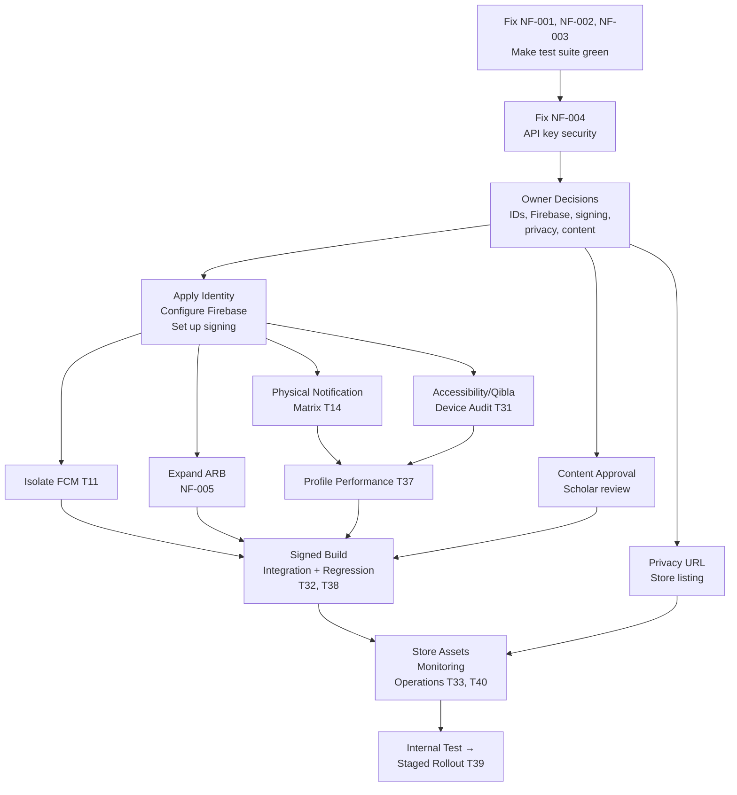

# UPDATED DEVELOPMENT & IMPROVEMENT PLAN

> **This document is the single source of truth for the Sakina Quran App's development status.**

---

## 1. Audit Update Summary

| Metric | Value |
|---|---|
| **Previous audit date** | 2026-09-22 |
| **Previous plan update** | 2026-09-28 (docs/production-fix-progress.md) |
| **Current re-audit date** | 2026-09-28 |
| **Original tracked tasks** | 40 (T01–T40) |
| **STATUS A — Completed** | 18 (T10 verified by B-02) |
| **STATUS B — Partially Completed** | 15 |
| **STATUS D — Needs Rework** | 1 (T11) |
| **STATUS F — Blocked** | 3 (T34, T35, T39) |
| **STATUS C — Not Implemented** | 0 |
| **STATUS E — No Longer Applicable** | 0 |
| **STATUS G — Unable to Verify** | 3 tasks have runtime/device aspects that cannot be verified statically |
| **New findings this re-audit** | 5 (NF-001 through NF-005) |
| **Confirmed test failures** | 0 — B-02 regression run on 2026-09-28 |
| **Static analysis** | `dart analyze lib`: **no issues** |
| **Full test suite** | **232 tests: 232 passed, 0 failed** (2026-09-28) |
| **Current production blockers** | 5 categories (identity/signing, content, notifications, privacy/store, device evidence) |
| **Production readiness** | **NOT READY** |

---

## 2. Current Project Baseline

### Architecture

| Layer | Implementation | Evidence |
|---|---|---|
| Framework | Flutter 3.48.0-0.5.pre / Dart 3.14 beta | [pubspec.yaml](file:///e:/Projects/01-personal/Quran-App/pubspec.yaml) |
| Structure | Feature-oriented `lib/features/` with data/domain/presentation layers | [lib/features](file:///e:/Projects/01-personal/Quran-App/lib/features) |
| State management | Provider/ChangeNotifier | Prayer, settings, media, Quran providers |
| DI | GetIt service locator | [service_locator.dart](file:///e:/Projects/01-personal/Quran-App/lib/core/di/service_locator.dart) |
| Navigation | GoRouter with ShellRoute (5-tab bottom nav) | [app_router.dart](file:///e:/Projects/01-personal/Quran-App/lib/core/navigation/app_router.dart) |
| Storage | SharedPreferences (prayers, bookmarks, settings, Khatma) | Multiple providers |
| Content | Bundled JSON: Quran, duas, hadith, prayer cities | [assets/](file:///e:/Projects/01-personal/Quran-App/assets) |
| Network | HTTP to Aladhan, RSS, MP3Quran, YouTube | Data source files |
| Firebase | Core, Messaging (dormant), Crashlytics (opt-in), Analytics (opt-in) | [firebase_options.dart](file:///e:/Projects/01-personal/Quran-App/lib/firebase_options.dart) |
| Notifications | flutter_local_notifications, WorkManager, boot receivers | [notification_service.dart](file:///e:/Projects/01-personal/Quran-App/lib/core/services/notification_service.dart) |
| Monitoring | Optional Crashlytics + Analytics, off by default, requires build flag + user opt-in | [monitoring_service.dart](file:///e:/Projects/01-personal/Quran-App/lib/core/services/monitoring_service.dart) |
| Localization | Partial ARB (11 strings), inline Arabic elsewhere | [app_ar.arb](file:///e:/Projects/01-personal/Quran-App/lib/l10n/app_ar.arb) |
| Fonts | Bundled Cairo + Amiri with OFL licenses | [fonts/](file:///e:/Projects/01-personal/Quran-App/fonts) |
| Themes | Light/dark Material 3 with `AppColors`, `AppTypography`, component themes | [app_theme.dart](file:///e:/Projects/01-personal/Quran-App/lib/core/theme/app_theme.dart) |

### Implemented Features

| Feature | Status | Key files |
|---|---|---|
| Splash | Working (2s delay) | [splash_screen.dart](file:///e:/Projects/01-personal/Quran-App/lib/features/splash/presentation/screens/splash_screen.dart) |
| Onboarding | Working | [onboarding_screen.dart](file:///e:/Projects/01-personal/Quran-App/lib/features/onboarding/presentation/screens/onboarding_screen.dart) |
| Home hub | Working (extracted widgets) | [home_screen.dart](file:///e:/Projects/01-personal/Quran-App/lib/features/onboarding/presentation/screens/home_screen.dart) |
| 5-tab navigation | Working | [main_navigation_shell.dart](file:///e:/Projects/01-personal/Quran-App/lib/core/navigation/main_navigation_shell.dart) |
| Quran browsing | Working offline | [quran_screen.dart](file:///e:/Projects/01-personal/Quran-App/lib/features/quran/presentation/screens/quran_screen.dart) |
| Quran reader | Working (extracted parts) | [surah_details_screen.dart](file:///e:/Projects/01-personal/Quran-App/lib/features/quran/presentation/screens/surah_details_screen.dart) |
| Quran search (verse) | Working offline with highlighting | [quran_search_screen.dart](file:///e:/Projects/01-personal/Quran-App/lib/features/quran/presentation/screens/quran_search_screen.dart) |
| Quran search (surah name/number) | **VERIFIED — B-02** | Same file — `_matchingSurahs` + `_loadSurahNames()` |
| Prayer times | Working with GPS/manual/city selection | [prayer_times_screen.dart](file:///e:/Projects/01-personal/Quran-App/lib/features/prayers/presentation/screens/prayer_times_screen.dart) |
| Prayer location dialog | Working with city catalog | [prayer_location_dialog.dart](file:///e:/Projects/01-personal/Quran-App/lib/features/prayers/presentation/screens/prayer_location_dialog.dart) |
| Qibla | Working in code; device unverified | [qibla_screen.dart](file:///e:/Projects/01-personal/Quran-App/lib/features/qibla/presentation/screens/qibla_screen.dart) |
| Duas | Working offline | [duas_screen.dart](file:///e:/Projects/01-personal/Quran-App/lib/features/duas/presentation/screens/duas_screen.dart) |
| Adhkar | Working offline | [azkar_screen.dart](file:///e:/Projects/01-personal/Quran-App/lib/features/duas/presentation/screens/azkar_screen.dart) |
| Hadith | Working offline | [hadeath_screen.dart](file:///e:/Projects/01-personal/Quran-App/lib/features/hadeath/presentation/screens/hadeath_screen.dart) |
| Tasbeeh | Working | [tasbeeh_screen.dart](file:///e:/Projects/01-personal/Quran-App/lib/features/quran/presentation/screens/tasbeeh_screen.dart) |
| Khatma | Working with completion dialog | khatma screens + `/khatma` route |
| Asma al-Husna | Present; content verification needed | [asma_al_husna_screen.dart](file:///e:/Projects/01-personal/Quran-App/lib/features/quran/presentation/screens/asma_al_husna_screen.dart) |
| Media (articles/audio/video) | Working with cache; offline partial | media screens |
| Settings | Working (theme, reading, location, notifications, monitoring, about, sources) | [settings_screen.dart](file:///e:/Projects/01-personal/Quran-App/lib/features/settings/presentation/screens/settings_screen.dart) |
| Notifications (local) | Scheduling code present; device delivery unverified | notification_service.dart |
| Bookmarks/Favorites | Working (SharedPreferences) | bookmark/favorites providers |
| Continue reading | Working | Home shortcut |
| Content manifest | Present but `pending_owner_review` | [content_manifest.json](file:///e:/Projects/01-personal/Quran-App/content_manifest.json) |

### Firebase Configuration State

> [!WARNING]
> **Two different Firebase projects are in use:**
> - Android/iOS: `quran-app-10d05` (project ID)
> - Web/macOS/Windows: `quran-app-754e2` (project ID)
> - Android namespace: `com.example.sakina_app`
> - iOS bundle: `com.example.quranApp`
> - iOS GoogleService-Info: **placeholder only** (`GoogleService-Info.plist.placeholder`)

---

## 3. Previous Findings vs Current State

| Area | Previous State (2026-09-22) | Current State (2026-09-28) | Change |
|---|---|---|---|
| Prayer location | Silent/fixed Cairo fallback | GPS/manual/city selection, method persistence, stale-request protection, timezone-aware display | ✅ Major improvement |
| Prayer cache | Write-through incomplete | Keyed cache, expiry, stale metadata, refresh paths | ✅ Improved; multi-day/DST pending |
| Prayer calculation | Methods 5 vs 3 conflict | Centralized `PrayerCalculationPolicy` with 3 selectable methods (MWL, Umm al-Qura, Egyptian) | ✅ Resolved |
| Signing/identity | Debug signing, sample IDs | Debug fallback rejected in Gradle; but identities remain `com.example.*` | ⚠️ Partial |
| Khatma route | `/khatma` missing from router | Canonical `/khatma` route defined with `CurrentWirdWidget` | ✅ Fixed |
| Notification routing | Khatma notification fell back to Home | `NotificationRouter._navigateToKhatma` now routes to `/khatma` | ✅ Fixed |
| Search | Explicitly "under development" | Offline verse search + surah name/number code present | ⚠️ Partial (3 tests fail) |
| Localization | No ARB, English prayer states | 11-string ARB, `flutter_localizations`/`intl` added, prayer screen localized | ⚠️ Partial |
| Dark mode | Gaps in components | Component themes added: navigation, sheet, dialog, input, scrollbar | ✅ Fixed |
| Fonts | Dynamic GoogleFonts fetch | Bundled Cairo + Amiri with OFL licenses | ✅ Fixed |
| Navigation | Feature-specific routing only | 5-tab bottom NavigationBar shell | ✅ Major improvement |
| Settings | Fragmented/missing | Full settings screen with sections | ✅ Major improvement |
| Content provenance | Not tracked | `content_manifest.json` with SHA-256 hashes, `pending_owner_review` | ⚠️ Partial |
| Privacy | No inventory | Draft policy, data inventory, data sources screen | ⚠️ Partial |
| Monitoring | Not configured | Crashlytics + Analytics, opt-in, disabled by default | ⚠️ Partial |
| FCM/push | Active at startup | Startup messaging disabled, auto-init disabled, local-only production | ✅ Improved |
| Splash | 3.5s fixed delay | 2s delay, independent onboarding state | ✅ Improved |
| External links | Placeholder donation URL | Removed | ✅ Fixed |
| Test contract | Integration test expected wrong loader | Fixed, 220 tests total, 217 pass | ⚠️ 3 failures remain |
| Home | Dense single hub | Extracted widgets (drawer, khatma, prayer, continue-reading) | ✅ Improved |
| Reader | Monolithic screen | Extracted data/content/controls/buttons parts | ✅ Improved |
| Timer | Per-second setState rebuilds | Per-minute refresh | ✅ Improved |
| iOS Firebase | Placeholder plist | Still placeholder (`GoogleService-Info.plist.placeholder`) | ❌ No change |

---

## 4. Master Task Status Table

| ID | Original Task | Category | Orig. Priority | Current Status | Completion | Remaining Work | New Issues | Next Action |
|---|---|---|---:|---|---:|---|---|---|
| T01 | GPS flow | Prayer | P1 | B | 75% | Physical denial/travel tests | NF-001 resolved | Device tests; B-01 verified 2026-09-28 |
| T02 | Location UI | Prayer | P1 | B | 75% | Policy and device UX | — | Scholarly method approval |
| T03 | Release signing | Release | P0 | B | 50% | Keystore/IDs/signed artifact | — | Owner credentials |
| T04 | Dark components | Theme | P1 | A | 100% | — | — | Maintenance |
| T05 | Caption contrast | Theme | P1 | A | 100% | — | — | Maintenance |
| T06 | Crashlytics | Monitoring | P1 | B | 75% | iOS/symbol/project verification | — | Approved Firebase project |
| T07 | Analytics | Monitoring | P2 | B | 75% | Dashboard/retention | — | Approved Firebase project |
| T08 | Privacy | Privacy | P0 | B | 75% | Owner/contact/public URL | — | Owner approval |
| T09 | Settings | UI/UX | P1 | A | 100% | — | — | Maintenance |
| T10 | Quran search | Feature | P1 | VERIFIED | 100% | None | NF-003 resolved | Maintenance; verified 2026-09-28 via B-02 |
| T11 | FCM decision | Architecture | P1 | D | 75% | Dormant code/dependency cleanup | — | Remove or isolate FCM |
| T12 | Content provenance | Content | P0 | B | 75% | Sources/reviewer approval | — | Owner/scholar review |
| T13 | Diagnostic route | Debug | P1 | A | 100% | — | — | Maintenance |
| T14 | Device notifications | Notifications | P0 | B | 50% | Physical matrix + future-day replenishment | — | Device testing |
| T15 | Primary navigation | Navigation | P2 | A | 100% | — | — | Maintenance |
| T16 | Continue reading | Feature | P2 | A | 100% | — | — | Maintenance |
| T17 | Refresh | Feature | P2 | A | 100% | — | — | Maintenance |
| T18 | Media offline UX | Feature | P2 | B | 75% | Complete cached/stale validation | — | Device testing |
| T19 | Splash | UI/UX | P2 | A | 100% | — | — | Maintenance |
| T20 | Khatma completion | Feature | P3 | A | 100% | — | — | Maintenance |
| T21 | Home refactor | Architecture | P2 | A | 100% | — | — | Maintenance |
| T22 | Reader refactor | Architecture | P2 | A | 100% | — | — | Maintenance |
| T23 | Color aliases | Theme | P2 | A | 100% | — | — | Maintenance |
| T24 | Directionality | RTL | P2 | B | 75% | Bidi/icon review | NF-002 resolved | Complete direction audit; B-04 verified 2026-09-28 |
| T25 | Use-case dirs | Architecture | P3 | A | 100% | — | — | Maintenance |
| T26 | Bundled fonts | Assets | P1 | A | 100% | — | — | Maintenance |
| T27 | Semantics | Accessibility | P1 | B | 75% | Screen-reader audit | — | Device audit |
| T28 | Dark visual tests | Testing | P2 | A | 100% | — | — | Maintenance |
| T29 | RTL tests | Testing | P1 | A | 100% | — | — | Maintenance |
| T30 | Network failure tests | Testing | P1 | A | 100% | — | — | Maintenance |
| T31 | Accessibility suite | Accessibility | P0 | B | 75% | Device audit | — | Physical accessibility testing |
| T32 | Integration flows | Testing | P1 | B | 75% | Physical/signed run | — | Signed artifact testing |
| T33 | Store listing | Release | P1 | B | 50% | Final assets/URL | — | Owner assets |
| T34 | iOS Firebase | Platform | P0 | F | 25% | Blocked on platform decision | — | Owner decision |
| T35 | Device matrix | QA | P0 | F | 25% | Physical devices unavailable | — | Acquire devices |
| T36 | Security review | Security | P0 | B | 50% | Independent review and owner key rotation | NF-004 confirmed | Resume B-03 after owner rotation evidence |
| T37 | Profiling | Performance | P2 | B | 50% | Profile measurements | — | Profile build |
| T38 | Final regression | QA | P0 | B | 50% | Physical/signed regression | NF-003 resolved | Automated suite 232/232; device regression remains |
| T39 | Store release | Release | P0 | F | 0% | All gates must close | — | All blockers |
| T40 | Operations | Operations | P1 | B | 50% | Alerts/owners/evidence | — | Approved project |

---

## 5. Completed Implementations

The following tasks are verified complete at repository/test scope:

| ID | Implementation | Evidence |
|---|---|---|
| T04 | Dark component themes (navigation, sheet, dialog, input, scrollbar) | [app_theme.dart](file:///e:/Projects/01-personal/Quran-App/lib/core/theme/app_theme.dart) + tests |
| T05 | Dedicated dark caption token with automated contrast check | app_colors.dart + test |
| T09 | Full settings screen: theme, reading, location, notifications, monitoring, about, sources | [settings_screen.dart](file:///e:/Projects/01-personal/Quran-App/lib/features/settings/presentation/screens/settings_screen.dart) |
| T10 | Quran surah name/number and verse lookup verified via B-02 | Seven focused cases and full suite 232/232, 2026-09-28 |
| T13 | Debug-only notification test route | [notification_test_screen.dart](file:///e:/Projects/01-personal/Quran-App/lib/features/settings/presentation/screens/notification_test_screen.dart), `kDebugMode` guard |
| T15 | 5-destination NavigationBar shell (Home, Quran, Prayer, Adhkar, Settings) | [main_navigation_shell.dart](file:///e:/Projects/01-personal/Quran-App/lib/core/navigation/main_navigation_shell.dart) |
| T16 | Continue-reading bookmark shortcut restoring reader position | Home widget |
| T17 | Prayer pull-to-refresh and media retry paths | Prayer screen + tests |
| T19 | 2-second splash delay with independent onboarding state tracking | [splash_screen.dart](file:///e:/Projects/01-personal/Quran-App/lib/features/splash/presentation/screens/splash_screen.dart) |
| T20 | Khatma completion congratulations dialog | Khatma feature |
| T21 | Home refactored: drawer, khatma actions, prayer header, continue-reading extracted | home widgets |
| T22 | Reader refactored: data, content, controls, buttons parts extracted | [reader_*.dart](file:///e:/Projects/01-personal/Quran-App/lib/features/quran/presentation/screens) |
| T23 | Legacy color aliases removed, canonical tokens migrated | app_colors.dart |
| T25 | `domain/usecases` directory structure verified | Feature directories |
| T26 | Cairo + Amiri bundled with OFL licenses; no dynamic GoogleFonts | [fonts/](file:///e:/Projects/01-personal/Quran-App/fonts), pubspec.yaml |
| T28 | Settings light/dark golden tests with bundled fonts | settings_golden_test.dart |
| T29 | RTL navigation + settings checks at 360px/2x text | settings_screen_test.dart |
| T30 | Network failure tests: media retry, GPS denial/stale regressions | Multiple test files |

---

## 6. Partially Completed Items

| ID | Implemented | Remaining |
|---|---|---|
| T01 | GPS/manual/city selection, stale-request protection, request ordering | Physical permission denial, travel; NF-001 resolved by B-01 |
| T02 | City catalog, coordinates, device location, calculation method UI | Scholarly method/madhab approval, policy documentation |
| T03 | Gradle rejects debug fallback for release | Owner keystore, approved app ID, signed artifact |
| T06 | Opt-in Crashlytics/Android plugin | Real Firebase project events, iOS upload, symbol verification |
| T07 | Allowlisted events (app_open, settings_open) | Dashboard validation, retention policy |
| T08 | Arabic draft policy, data inventory, in-app sources page | Owner contact, retention approval, public URL |
| T10 | VERIFIED via B-02: verse, surah name/number search | None at repository/test scope |
| T12 | SHA-256 hashes, in-app disclosure, release gate | Source, edition, license, reviewer sign-off |
| T14 | Scheduling/routing code, boot receivers | Physical delivery matrix, future-day replenishment |
| T18 | Retry/error paths present | Full cached/stale validation for all media types |
| T24 | Removed redundant directionality wrapper | Bidi/icon direction review; NF-002 tooltip verified via B-04 |
| T27 | Semantics labels on settings + icon tooltips | Complete screen-reader audit across all screens |
| T31 | Automated target/contrast/large-text checks | Physical TalkBack/VoiceOver audit |
| T32 | Settings/theme/search/reader integration flows | Physical signed-build execution |
| T33 | Arabic listing copy + screenshot requirements | Final assets, privacy URL, owner approval |
| T36 | Local security checks (signing, .gitignore, HTTPS) | Independent security review, NF-004 |
| T37 | Offline fonts, shorter splash | Profile-mode startup/frame/memory measurements |
| T38 | 232 tests pass (2026-09-28) | Physical device regression |
| T40 | Runbook/monitoring integration drafted | Alerts, named owners, production evidence |

---

## 7. Remaining Development Work

### P0 — Production Blockers

1. **Identity/signing (T03):** Supply approved Android app ID, iOS bundle ID (if applicable), matching Firebase project/config, protected signing credentials, and verify signed artifact
2. **Content provenance (T12):** Obtain source, edition, license, and qualified reviewer sign-off for Quran, duas, hadith, and prayer data
3. **Notification evidence (T14):** Physical foreground/background/terminated delivery, permission denial/recovery, reboot, upgrade, timezone, and future-day replenishment
4. **Privacy/store package (T08, T33):** Public privacy URL, support contact, store listing assets, approved disclosures
5. **Device evidence (T35, T31):** TalkBack/VoiceOver, large text, Qibla sensors, performance measurements, signed install

### P1 — Critical

6. **NF-001:** VERIFIED via B-01 — manual prayer error handling
7. **NF-003:** VERIFIED via B-02 — all lookup tests and full suite pass
8. **T11:** Isolate or remove dormant FCM code/dependency
9. **T06/T07:** Verify monitoring on approved Firebase project
10. **T36:** Complete security review

### P2 — Important

11. **NF-002:** Restore back-button tooltips in duas/azkar screens
12. **T37:** Run profile-mode measurements
13. **T18:** Validate media cached/stale behavior
14. **T24:** Complete bidi/icon direction audit
15. **NF-005:** Expand ARB localization coverage

### P3 — Enhancement

16. Post-release polish, global search, quiet hours, richer offline media

---

## 8. Items Requiring Rework

### T11 — FCM Decision (STATUS D, 75%)

**Original Finding:** FCM token backend registration was a placeholder.  
**Implementation:** Local reminders selected for production. Startup messaging/token registration and native auto-init disabled. Dormant diagnostic code/dependency retained.  
**Problem:** `firebase_messaging` remains in `pubspec.yaml` (line 66), `firebase_messaging_service.dart` (370 lines) is still present with active background handler code and FCM initialization paths. This creates:
- Unnecessary dependency size
- Privacy/audit confusion (FCM code exists but isn't used)
- `firebaseMessagingBackgroundHandler` is annotated `@pragma('vm:entry-point')` and will be compiled

**Required Action:** Either fully remove `firebase_messaging` dependency and `firebase_messaging_service.dart`, or clearly isolate it behind a feature flag with documentation. The current state misleadingly suggests push notification capability.

---

## 9. Blocked Items

| ID | Blocker | Required Resolution |
|---|---|---|
| T34 (iOS Firebase) | No launch-platform decision, no approved bundle/project identity, iOS GoogleService-Info is a placeholder file | Owner must decide iOS launch scope, supply genuine native Firebase config |
| T35 (Device matrix) | Physical test devices and evidence capture unavailable | Acquire Android test devices; decide iOS inclusion |
| B-03 (YouTube API key) | Key committed in documentation; rotation evidence unavailable | Owner replaces/revokes key and validates private configuration |
| T39 (Store release) | All P0 gates must close: credentials, content approval, device evidence, signed artifact validation | Complete all Phase 1–6 items |

---

## 10. New Findings

### NF-001 — Manual prayer configuration lacks controlled failure handling *(resolved: B-01 VERIFIED, 2026-09-28)*

The evidence below records the original finding. See progress history for implementation and verification.

**Evidence:** [prayer_times_provider.dart](file:///e:/Projects/01-personal/Quran-App/lib/features/prayers/presentation/providers/prayer_times_provider.dart) lines 157-187: `selectLocation()` awaits `_notificationScheduler.cancelPrayerNotifications()` and multiple `_preferences?.set*` calls **without** try-catch. If any throws, the exception propagates to the caller unhandled.  
**Impact:** Storage or scheduler failure becomes an uncaught exception; user unsure if location was saved.  
**Root Cause:** Error handling was removed while asynchronous persistence remained.  
**Priority:** P1  
**Action:** Wrap the notification cancellation and preference writes in error handling; show localized retry on failure; add scheduler-failure and preference-write-failure tests.  
**Acceptance:** No uncaught UI exception from `selectLocation`; latest request remains authoritative; failed saves show localized retry; passed saves are confirmed.

### NF-002 — Back-button tooltips removed from dua/azkar screens *(resolved: B-04 VERIFIED, 2026-09-28)*

The following evidence describes the original finding. B-04 restored all three tooltips; verification is recorded in the latest progress history.

**Evidence:** [duas_screen.dart](file:///e:/Projects/01-personal/Quran-App/lib/features/duas/presentation/screens/duas_screen.dart) line 29 and [azkar_screen.dart](file:///e:/Projects/01-personal/Quran-App/lib/features/duas/presentation/screens/azkar_screen.dart) line 26: `IconButton` has no `tooltip` property. `Semantics` wrapper with label is present but doesn't provide hover/pointer tooltip.  
**Impact:** Pointer/desktop users lose hover guidance on back buttons.  
**Priority:** P2  
**Action:** Add `tooltip: 'الرجوع'` to each back IconButton, or adopt a shared back-button component with both semantics and tooltip.  
**Acceptance:** Back actions expose both semantic labels and hover tooltips.

### NF-003 — Quran surah name/number lookup tests fail *(resolved: B-02 VERIFIED, 2026-09-28)*

**Evidence:** `flutter test` output — 3 deterministic failures:
```
surah lookup supports 1 offline
surah lookup supports الفاتحة offline
surah lookup supports ١ offline
```
All in [quran_search_screen_test.dart](file:///e:/Projects/01-personal/Quran-App/test/features/quran/presentation/screens/quran_search_screen_test.dart). The test expects `ListTile` to appear after entering a query, but no `ListTile` is rendered.  
**Root Cause:** `_loadSurahNames()` uses `rootBundle.loadString('assets/quran_master.json')` asynchronously. The `quran_master.json` is a 2.7MB file (line 54). In the test environment, the asynchronous metadata loading race condition means `_surahs` may not be populated when the query is entered, even though `pumpAndSettle` is called. The test pre-loads the asset (line 41) but the widget's internal async state may not resolve before `_matchingSurahs` is computed.  
**Priority:** P1  
**Action:** Trace the async loading/rendering timing; ensure surah metadata is available before query evaluation completes; fix tests to be deterministic.  
**Acceptance:** PASS — all three queries render exactly one result; full current suite 232/232 passed (B-02). The failure evidence above is historical.

### NF-004 — YouTube API key committed in the development plan *(confirmed; B-03 BLOCKED, 2026-09-28)*

**Evidence:** Exact-value search found the local YouTube credential in tracked `updated_development_plan.md`, introduced by commit `cbe5823` on 2026-09-28. At audit HEAD `2b913b3`, this was the only tracked working-tree path containing that value. `git log --all -- .env` and `git ls-files -- .env` returned no entries; `.env` is ignored by `.gitignore:48`. The repository is not shallow. This checks locally available refs, not inaccessible remote/deleted history.
**Impact:** The credential must be treated as exposed; remote validity, restrictions and rotation status have not been verified.
**Root Cause:** A security finding copied the credential into version-controlled documentation. Ignoring `.env` did not protect this copy.
**Priority:** P1 (Security)
**Action Taken:** Removed the exact credential from the current working-tree plan. Runtime code already reads `YOUTUBE_API_KEY` through `String.fromEnvironment`; no runtime configuration change was needed.
**Required Action:** Key owner rotates/replaces the exposed credential, updates the ignored local/CI configuration, disables the old credential, and supplies non-secret evidence. No Google Cloud CLI or credential-management connector is available in this session. Redaction does not remove Git history or revoke the credential.
**Acceptance:** Working-tree cleanup and ignored/untracked `.env` pass. Historical exposure is confirmed; rotation/revocation remains unverified. B-03 remains BLOCKED.
### NF-005 — ARB localization covers only 11 strings *(NEW FINDING)*

**Evidence:** [app_ar.arb](file:///e:/Projects/01-personal/Quran-App/lib/l10n/app_ar.arb) contains only 11 strings: `prayerTitle`, `prayerLoadError`, `retry`, `choosePrayerLocation`, `todayPrayerTimes`, `searchQuran`, `searchAyah`, `searchHint`, `searchEmpty`. Many screens still use inline Arabic string literals (e.g., Quran search hint at line 108: `'اسم السورة أو رقمها أو جزء من آية'`, all navigation labels, all settings labels, all error messages across features).  
**Impact:** Future localization/translation work is blocked; string inconsistency risk; difficult to audit all user-facing text.  
**Root Cause:** ARB was introduced for core prayer/search screens but not extended to other features.  
**Priority:** P2  
**Action:** Systematically extract all user-facing string literals to ARB. Prioritize: settings, navigation, error messages, feature titles, then content-adjacent text.  
**Acceptance:** All user-visible strings come from ARB resources; no inline Arabic string literals remain for UI text.

---

## 11. Regressions Discovered

| Regression | Type | Evidence | Severity |
|---|---|---|---|
| NF-001: Error handling removed from `selectLocation` | Error handling | prayer_times_provider.dart | P1 |
| NF-002: Tooltip removed from 3 back buttons | Resolved — B-04 VERIFIED | Six hover/semantics/navigation cases pass | P2 |
| NF-003: 3 surah lookup tests fail | Resolved — B-02 VERIFIED | 7 focused tests and 232/232 full suite | P1 |

No confirmed navigation, theme, RTL, Firebase, notification delivery, or data integrity regression beyond the above. Device-only regressions remain **Unable to Verify** without physical testing.

---

## 12. Current Production Blockers

| # | Blocker | Evidence | Required Fix | Acceptance Criterion |
|---|---|---|---|---|
| PB-1 | Identity/signing | `com.example.sakina_app` in [build.gradle.kts](file:///e:/Projects/01-personal/Quran-App/android/app/build.gradle.kts) L43; iOS `com.example.quranApp`; two Firebase projects; no key.properties | Approved IDs, single Firebase project, protected signing | Signed artifact installs, matches approved IDs, identity gate passes |
| PB-2 | Religious content approval | All 4 entries in [content_manifest.json](file:///e:/Projects/01-personal/Quran-App/content_manifest.json) show `"approvalStatus": "pending_owner_review"` | Qualified reviewer provides source, edition, license, approval | `verify_content.py --require-approved` passes |
| PB-3 | Notification delivery | No physical device evidence for permission, delivery, tap, reboot, timezone | Execute full device notification matrix | Each case has expected/actual result and evidence |
| PB-4 | Privacy/store readiness | No public privacy URL, no support contact, no store assets | Owner supplies policy URL, contact, screenshots, listing | Store checklist has no missing items |
| PB-5 | Physical reliability | No TalkBack/VoiceOver, Qibla sensor, large text, performance, or signed install evidence | Execute device QA matrix per [DEVICE_QA_AND_OPERATIONS.md](file:///e:/Projects/01-personal/Quran-App/docs/DEVICE_QA_AND_OPERATIONS.md) | Each case has expected/actual result and evidence |

---

## 13. Updated Priority Matrix

| Priority | Scope | Change from Previous |
|---|---|---|
| **P0** | Signing/identity (T03), content approval (T12), notification evidence (T14), privacy/store (T08/T33), device evidence (T31/T35), iOS Firebase (T34), final regression (T38), store release (T39) | Unchanged |
| **P1** | NF-001 error handling, NF-003 test fix, NF-004 API key rotation, FCM isolation (T11), monitoring verification (T06/T07), security review (T36), location/travel UX (T01/T02), integration validation (T32), store assets (T33), operations (T40) | NF-004 added |
| **P2** | NF-002 tooltip, NF-005 ARB expansion, profiling (T37), media stale/cache (T18), bidi cleanup (T24), analytics (T07) | NF-005 added |
| **P3** | Global search, quiet hours, richer offline media, post-release polish | Unchanged |

---

## 14. Current Production Readiness

### Status: **NOT READY**

| Area | Status | Evidence |
|---|---|---|
| Functionality | Automated checks pass; device evidence pending | B-01/B-02 verified; 232 tests pass |
| UI | ✅ Adequate | Material 3, light/dark themes, component themes, design tokens |
| UX | ⚠️ Needs Attention | Good settings/navigation; prayer location flow needs error handling fix |
| Accessibility | ❌ Insufficient Evidence | Automated checks only; no device screen-reader/large-text audit |
| RTL | ⚠️ Needs Attention | Global RTL configured; bidi/icon direction review pending |
| Religious Content | ❌ Blocked | Assets present; all sources `pending_owner_review` |
| Performance | ❌ Insufficient Evidence | Improvements made (fonts, splash); no profile measurements |
| Security | ⚠️ Needs Attention | Local checks done; API key exposure (NF-004); independent review pending |
| Reliability | ❌ Insufficient Evidence | No device notification/reboot/timezone/offline evidence |
| Notifications | ❌ Blocked | Code present; no physical delivery/tap/reboot evidence |
| Firebase | ⚠️ Needs Attention | Two projects in use; iOS is placeholder; monitoring is opt-in |
| Testing | Automated checks pass; device evidence pending | 232/232 pass; B-02 resolved |
| Release Config | ❌ Blocked | Debug-fallback blocked; sample IDs remain; no signed artifact |
| Store Readiness | ❌ Blocked | Draft listing; no privacy URL, screenshots, or owner approval |

---

## 15. Updated Development Roadmap

### Phase 1 — Critical Fixes (Code)

- VERIFIED B-01 / NF-001: Restored error handling in `selectLocation` (2026-09-28)
- VERIFIED B-02 / NF-003: Surah lookup tests fixed; full suite 232/232 (2026-09-28)
- Fix NF-004: Rotate YouTube API key if committed to git history; remove `.env` from any tracked state
- VERIFIED B-04: Restore tooltips (NF-002), 2026-09-28

### Phase 2 — Core Functional Completion (Owner-Dependent)

- Finalize prayer method/madhab/timezone policy with content owner
- Obtain approved Android app ID, iOS bundle ID (if applicable), Firebase project
- Supply signing credentials
- Obtain religious content source/edition/license/reviewer approvals
- Supply public privacy URL and support contact
- Decide iOS launch scope

### Phase 3 — Technical Cleanup

- Isolate or remove dormant FCM code and `firebase_messaging` dependency (T11)
- Expand ARB localization to all features (NF-005)
- Complete bidi/icon direction audit (T24)
- Configure approved Firebase project for monitoring (T06/T07)

### Phase 4 — Performance & Polish

- Run profile-mode startup/frame/memory measurements on physical device (T37)
- Validate media cached/stale behavior (T18)
- Optimize any measured problems

### Phase 5 — QA & Stability

- Execute physical device notification matrix (T14): permission, delivery, tap, reboot, upgrade, timezone
- Execute TalkBack/VoiceOver/large text audit (T31)
- Test Qibla on physical compass sensor
- Run signed-build integration tests (T32)
- Test future-day prayer notification replenishment
- Complete security review (T36)

### Phase 6 — Production Preparation

- Build signed release artifact with approved IDs and Firebase config
- Install/upgrade/uninstall test
- Run full regression (T38) with zero failures
- Run content integrity verification with `--require-approved`
- Approve store listing assets and screenshots
- Configure production monitoring and alerts

### Phase 7 — Release & Post-Release

- Internal test track distribution
- Staged rollout with crash/ANR/notification thresholds
- Named operational ownership
- Corrective-build process documented

---

## 16. Updated Implementation Order

| Order | Task | Dependencies |
|---:|---|---|
| 1 | Fix NF-001, NF-002, NF-003 (code fixes, make suite green) | None |
| 2 | Fix NF-004 (rotate API key if needed) | Git history check |
| 3 | Owner decisions: platform, app IDs, Firebase project, signing credentials | Product owner |
| 4 | Owner decisions: prayer method policy, content approval, privacy URL | Content owner/scholar |
| 5 | Apply approved IDs, generate Firebase config, configure signing | #3 output |
| 6 | Isolate/remove FCM (T11) | Product decision from #3 |
| 7 | Expand ARB localization (NF-005) | None (can parallel with #3-5) |
| 8 | Profile performance on physical device (T37) | Device available |
| 9 | Physical notification/permission/reboot matrix (T14) | #5 (signed build) |
| 10 | Physical accessibility/Qibla/RTL audit (T31, T35) | #5 + device |
| 11 | Signed-build integration + final regression (T32, T38) | #5 + #9 + #10 |
| 12 | Store assets, monitoring activation, operations (T33, T40) | #5 + #11 |
| 13 | Internal test → staged rollout (T39) | All above |

---

## 17. Final Development Backlog

### B-01: Harden manual prayer failure handling

| Field | Value |
|---|---|
| **ID** | B-01 |
| **Title** | Harden manual prayer failure handling |
| **Category** | Prayer / Error Handling |
| **Priority** | P1 |
| **Current Status** | VERIFIED |
| **Completion** | 100% |
| **Last Updated** | 2026-09-28 |
| **Remaining Work** | None for B-01; physical T01 tests remain separate. |
| **Description** | `selectLocation()` in `PrayerTimesProvider` performs notification cancellation and 4 SharedPreferences writes without try-catch. Any failure propagates as an uncaught exception. |
| **Why Needed** | Users selecting a new prayer location must receive confirmation or localized retry, not a crash. |
| **Implementation Details** | Wrap lines 173-185 in try-catch with narrowly scoped error handling. On failure: keep previous state, set `_errorMessage` with localized text, call `notifyListeners()`. Add unit tests: scheduler-failure test, preference-write-failure test. |
| **Dependencies** | None |
| **Acceptance Criteria** | No uncaught exception from `selectLocation`; failed saves show localized retry; successful saves proceed to fetch; 2 new test cases pass |
| **Validation Method** | `flutter test test/features/prayers` passes with new tests |
| **Definition of Done** | Code, tests pass, failure/success states exercised |

---

### B-02: Fix Quran surah lookup test failures

| Field | Value |
|---|---|
| **ID** | B-02 |
| **Title** | Fix Quran surah lookup test failures |
| **Category** | Quran / Testing |
| **Priority** | P1 |
| **Current Status** | VERIFIED |
| **Completion** | 100% |
| **Last Updated** | 2026-09-28 |
| **Implementation Notes** | Test harness mounts the screen and awaits the bundled metadata in one runAsync context. Production code unchanged. Both themes, RTL, empty/no-match states and surah/ayah navigation covered. |
| **Files Changed** | test/features/quran/presentation/screens/quran_search_screen_test.dart; updated_development_plan.md |
| **Verification** | Seven focused cases pass; full suite 232/232; static analysis clean. See acceptance evidence in progress history. |
| **Remaining Work** | None |
| **Description** | `_loadSurahNames()` asynchronously loads 2.7MB `quran_master.json`. In tests, `_surahs` is not populated when query evaluation occurs despite `pumpAndSettle`. |
| **Why Needed** | Full test suite must be green. Surah name/number lookup is an advertised feature. |
| **Implementation Details** | Either: (a) ensure `_loadSurahNames` completes before the first build via `await` in `initState` + `FutureBuilder`, or (b) fix the test to properly await the async metadata loading. Verify the widget path produces matching `ListTile` results. |
| **Dependencies** | None |
| **Acceptance Criteria** | All 3 lookup tests pass (`الفاتحة`, `١`, `1`); full current suite passes (232/232 verified; 220 was the audit baseline); each query renders one result with subtitle `سورة 1` |
| **Validation Method** | `flutter test test/features/quran/presentation/screens/quran_search_screen_test.dart` and `flutter test` |
| **Definition of Done** | Zero test failures; no production behavior change for verse search |

---

### B-03: Rotate or verify YouTube API key security

| Field | Value |
|---|---|
| **ID** | B-03 |
| **Title** | Rotate or verify YouTube API key security |
| **Category** | Security |
| **Priority** | P1 |
| **Current Status** | BLOCKED |
| **Completion** | 50% (audit and local cleanup complete; rotation and post-rotation validation pending) |
| **Last Updated** | 2026-09-28 |
| **Files Changed** | updated_development_plan.md |
| **Blocking Reason** | Exact YouTube key committed in plan at cbe5823; no available Google Cloud credential-management access or rotation evidence. |
| **Required Dependency** | Key owner with access to the owning Google Cloud project. |
| **What Is Needed** | Replace/revoke exposed key, update ignored local/CI configuration, provide non-secret rotation evidence and validate YouTube integration. |
| **Remaining Work** | Owner rotation/revocation and post-rotation verification. |
| **Description** | `.env` is ignored and absent from local reachable history, but the same YouTube key was committed in this plan at cbe5823. Current working-tree copy is redacted; history remains exposed. |
| **Why Needed** | Exposed API keys can lead to unauthorized usage, quota abuse, or billing impact. |
| **Implementation Details** | Run `git log --all --diff-filter=A -- .env` to check if `.env` was ever committed. If yes: rotate the key in Google Cloud Console immediately. Ensure no secrets are tracked. |
| **Dependencies** | Git history access |
| **Acceptance Criteria** | API key not in any tracked git commit; if previously committed, key is rotated; `.env` confirmed absent from `git ls-files` |
| **Validation Method** | `git log --all -- .env` shows no results OR key has been rotated |
| **Definition of Done** | Verified + documented |

---

### B-04: Restore back-button tooltips

| Field | Value |
|---|---|
| **ID** | B-04 |
| **Title** | Restore back-button tooltips in duas/azkar screens |
| **Category** | Accessibility / UX |
| **Priority** | P2 |
| **Current Status** | VERIFIED |
| **Completion** | 100% |
| **Last Updated** | 2026-09-28 |
| **Implementation Notes** | Added Arabic tooltip to all three back IconButtons, retaining semantic labels and navigation callbacks. |
| **Files Changed** | Three duas/azkar screens; back_button_tooltip_test.dart; updated_development_plan.md |
| **Verification** | 42 focused/regression tests pass; static analysis clean; six mouse-hover/semantics/navigation cases in light/dark RTL. |
| **Remaining Work** | None for B-04; broader T24 direction audit and physical accessibility remain separate. |
| **Description** | `IconButton` back buttons in `duas_screen.dart`, `azkar_screen.dart`, and `azkar_details_screen.dart` have `Semantics` wrappers but no `tooltip` property. |
| **Why Needed** | Pointer/desktop hover guidance; consistent with other screens. |
| **Implementation Details** | Add `tooltip: 'الرجوع'` to each back `IconButton`. Consider extracting a shared `AppBackButton` widget. |
| **Dependencies** | None |
| **Acceptance Criteria** | Back buttons show tooltip on hover; semantic labels still work for screen readers |
| **Validation Method** | Manual hover test + existing accessibility tests pass |
| **Definition of Done** | Code change + no test regressions |

---

### B-05: Provision production identity and signing

| Field | Value |
|---|---|
| **ID** | B-05 |
| **Title** | Provision production identity and signing |
| **Category** | Release |
| **Priority** | P0 |
| **Current Status** | T03/T34 — blocked on owner credentials |
| **Description** | Android uses `com.example.sakina_app`, iOS uses `com.example.quranApp`, two different Firebase projects. Signing requires `key.properties` which doesn't exist. |
| **Why Needed** | Cannot publish to stores with `com.example.*` identifiers or debug signing. |
| **Implementation Details** | Owner supplies: approved Android app ID, iOS bundle ID (if applicable), single Firebase project, signing keystore. Update `build.gradle.kts`, `firebase_options.dart`, iOS config. Run `flutterfire configure`. |
| **Dependencies** | Product owner decision |
| **Acceptance Criteria** | `verify_release.py` passes; signed artifact installs correctly; Firebase initializes on device |
| **Validation Method** | Signed build + install test |
| **Definition of Done** | Signed artifact verified on physical device |

---

### B-06: Approve content provenance

| Field | Value |
|---|---|
| **ID** | B-06 |
| **Title** | Approve content provenance for all religious collections |
| **Category** | Content |
| **Priority** | P0 |
| **Current Status** | T12 — `pending_owner_review` for all 4 collections |
| **Description** | Quran, duas, prayers data, and hadith assets exist but have no approved source, edition, license, or reviewer. |
| **Why Needed** | Religious content must be from verified sources with proper attribution. |
| **Implementation Details** | Content owner/scholar provides: source URL/reference, edition/version, license, reviewer name, approval date. Update `content_manifest.json`. |
| **Dependencies** | Content owner + qualified reviewer |
| **Acceptance Criteria** | `verify_content.py --require-approved` passes; all approvals archived |
| **Validation Method** | Script passes + approval records exist |
| **Definition of Done** | All 4 collections approved and documented |

---

### B-07: Verify physical notification delivery

| Field | Value |
|---|---|
| **ID** | B-07 |
| **Title** | Complete physical notification delivery evidence |
| **Category** | Notifications |
| **Priority** | P0 |
| **Current Status** | T14 — 50% |
| **Description** | Notification scheduling and routing code exists but has never been verified on a physical device for permission denial/recovery, delivery timing, tap routing, reboot survival, timezone changes, or future-day replenishment. |
| **Why Needed** | Notification reliability is critical for a prayer app. |
| **Implementation Details** | Execute the full matrix in [DEVICE_QA_AND_OPERATIONS.md](file:///e:/Projects/01-personal/Quran-App/docs/DEVICE_QA_AND_OPERATIONS.md). Implement future-day prayer replenishment if not yet present. |
| **Dependencies** | B-05 (signed build), physical devices |
| **Acceptance Criteria** | Each notification case has recorded expected/actual result and evidence |
| **Validation Method** | Physical device test with evidence capture |
| **Definition of Done** | All cases pass with archived evidence |

---

### B-08: Complete privacy/store package

| Field | Value |
|---|---|
| **ID** | B-08 |
| **Title** | Complete privacy/store package |
| **Category** | Release |
| **Priority** | P0 |
| **Current Status** | T08/T33 — 50-75% |
| **Description** | Draft privacy policy and store listing copy exist but no public URL, support contact, or final screenshots. |
| **Why Needed** | Stores require privacy policy URL and complete listing. |
| **Implementation Details** | Owner provides: support email, hosts privacy policy, approves store copy, provides/approves screenshots. |
| **Dependencies** | Product owner |
| **Acceptance Criteria** | Public privacy URL resolves; store listing is complete; owner approves |
| **Validation Method** | URL check + listing review |
| **Definition of Done** | All store requirements met |

---

### B-09: Physical accessibility and reliability audit

| Field | Value |
|---|---|
| **ID** | B-09 |
| **Title** | Complete accessibility/Qibla/reliability device audit |
| **Category** | QA / Accessibility |
| **Priority** | P0 |
| **Current Status** | T31/T35 — blocked on devices |
| **Description** | No TalkBack/VoiceOver, Qibla sensor, large text, motion, or signed install evidence. |
| **Why Needed** | Accessibility compliance and sensor accuracy verification. |
| **Implementation Details** | Walk through all primary flows with TalkBack (Android) and VoiceOver (iOS if applicable). Test Qibla on physical compass. Record large text, reduced motion, both themes. |
| **Dependencies** | Physical devices, B-05 (signed build) |
| **Acceptance Criteria** | Each case has expected/actual/evidence |
| **Validation Method** | Physical device walk-through |
| **Definition of Done** | All cases pass with archived evidence |

---

### B-10: Isolate dormant FCM code

| Field | Value |
|---|---|
| **ID** | B-10 |
| **Title** | Isolate or remove dormant FCM code and dependency |
| **Category** | Architecture |
| **Priority** | P1 |
| **Current Status** | T11 (STATUS D) |
| **Description** | `firebase_messaging` in pubspec.yaml, `firebase_messaging_service.dart` (370 lines), and `firebaseMessagingBackgroundHandler` entry point remain despite production using local-only notifications. |
| **Why Needed** | Clean architecture, smaller bundle, no privacy/audit confusion. |
| **Implementation Details** | Remove `firebase_messaging` from dependencies, delete `firebase_messaging_service.dart`, update any remaining imports. If FCM might be needed later, document the decision and feature-flag it. |
| **Dependencies** | Product decision on push notifications |
| **Acceptance Criteria** | No `firebase_messaging` import in production code; startup/privacy tests pass; bundle size reduced |
| **Validation Method** | `dart analyze lib`, `flutter test`, grep for firebase_messaging imports |
| **Definition of Done** | Clean codebase with no dormant push notification code |

---

## 18. Acceptance Criteria

| Area | Criterion |
|---|---|
| Prayer | No silent fixed fallback; explicit location/method/timezone; localized recoverable errors for all configuration paths |
| Identity | All platform IDs match approved release matrix; no `com.example.*` |
| Signing | Release artifact not signed with debug keys; keystore is protected |
| Content | All collections have approved source/edition/license/reviewer |
| Notifications | Physical evidence for permission, delivery, tap, reboot, timezone, future-day |
| Privacy | Public URL resolves; data inventory is complete; opt-out verified |
| Accessibility | TalkBack/VoiceOver complete primary flows; large text at 360dp; touch targets ≥ 48dp |
| Search | Surah name, number, and verse queries all work offline with deterministic test results |
| Testing | Full current suite green (232/232); no known automated failures |
| Security | No API keys in version control; no debug signing; HTTPS for all calls |
| FCM | No unsupported push claim; dormant code removed or feature-flagged |

---

## 19. Definition of Done

Code/configuration exists, focused checks pass, affected flows and failure states are exercised, Arabic/RTL/accessibility impact is reviewed, documentation is updated, and external dependencies have recorded evidence. Release work additionally requires: build SHA, version, device/OS, locale/timezone, permissions, expected/actual result, and archived artifact or logs.

---

## 20. Final Release Requirements

Per [RELEASE_REQUIREMENTS.md](file:///e:/Projects/01-personal/Quran-App/docs/RELEASE_REQUIREMENTS.md) and [DEVICE_QA_AND_OPERATIONS.md](file:///e:/Projects/01-personal/Quran-App/docs/DEVICE_QA_AND_OPERATIONS.md):

1. `dart format --set-exit-if-changed lib test integration_test` — zero changes
2. `dart analyze lib` — no issues ✅ (currently passing)
3. `flutter test` — zero failures ✅ (232/232 passed, 2026-09-28)
4. Integration tests pass on device
5. `verify_content.py --require-approved` — passes ❌ (currently blocked)
6. `verify_release.py` — identity gate passes ❌ (currently blocked)
7. Signed build installs correctly
8. Full device QA matrix completed
9. Privacy URL resolves
10. Store listing approved
11. Monitoring configured on approved project
12. Evidence archive assembled

---

## 21. Post-Release Recommendations

1. Use internal testing track before any public staged rollout
2. Monitor: crashes, ANRs, notification failures, opt-in rates, user reports
3. Set crash/ANR thresholds; pause rollout if exceeded
4. Process religious content changes through source/reviewer workflow
5. Consider for future releases: global search, quiet hours, notification history, richer offline media, further architecture decomposition
6. Establish regular dependency update cadence

---

## 22. Final Master Action Plan



**Immediate code actions (no owner dependency):**
1. VERIFIED: `selectLocation` error handling (NF-001 / B-01)
2. VERIFIED: Quran surah lookup test failures (NF-003 / B-02)
3. VERIFIED: Back-button tooltips (NF-002 / B-04)
4. Verify API key git history and rotate if needed (NF-004)

**Owner-dependent actions (cannot proceed without external input):**
5. Approved Android app ID, iOS bundle ID (if applicable)
6. Single Firebase project + genuine per-platform configs
7. Signing credentials (keystore, key.properties)
8. Religious content source/edition/license/reviewer approvals
9. Public privacy URL and support contact
10. Store listing approval and screenshots

**After owner inputs are received:**
11. Apply identities, regenerate Firebase options, configure signing
12. Execute physical device matrix (notifications, accessibility, Qibla, performance)
13. Run complete signed-build regression
14. Assemble release evidence archive
15. Internal test → staged rollout

> **The project has made substantial progress since the original audit.** 18/40 tasks are complete at repository/test scope, and the architecture, navigation, settings, prayer configuration, dark mode, and font infrastructure are significantly improved. The remaining work is primarily owner-dependent decisions (identity, content approval, privacy), device verification (notifications, accessibility, sensors), and remaining tooltip, localization, security and FCM work. The latest automated suite passes 232/232 tests. No fundamental architecture or product problems remain.

## 23. Live Incremental Master Status Table

Historical comparison sections retain original audit observations. Live tables and the latest history entry take precedence. B-02 also closes T10 at repository/test scope; T01 and T38 still require physical verification. Latest full suite: 232/232 passed.

| ID | Task | Priority | Status | Completion | Last Updated | Notes |
|---|---|---|---|---:|---|---|
| B-01 | Harden manual prayer failure handling | P1 | VERIFIED | 100% | 2026-09-28 | NF-001 resolved |
| B-02 | Fix Quran surah lookup tests | P1 | VERIFIED | 100% | 2026-09-28 | 7 focused tests; full suite 232/232; NF-003 resolved |
| B-03 | Verify API key security | P1 | BLOCKED | 50% | 2026-09-28 | Explicitly deferred by user; rotation evidence still required |
| B-04 | Restore tooltips | P2 | VERIFIED | 100% | 2026-09-28 | NF-002 resolved; hover/semantics/navigation verified in both themes and RTL |
| B-05 | Identity and signing | P0 | BLOCKED | 0% | 2026-09-28 | Owner credentials and approved IDs |
| B-06 | Content approval | P0 | BLOCKED | 0% | 2026-09-28 | Owner and qualified reviewer |
| B-07 | Notification evidence | P0 | BLOCKED | 0% | 2026-09-28 | B-05 and physical devices |
| B-08 | Privacy/store package | P0 | BLOCKED | 0% | 2026-09-28 | Owner URL, contact, assets, approval |
| B-09 | Device accessibility/reliability | P0 | BLOCKED | 0% | 2026-09-28 | B-05 and devices |
| B-10 | Isolate FCM | P1 | BLOCKED | 0% | 2026-09-28 | Product decision |

# IMPLEMENTATION PROGRESS HISTORY

## 2026-09-28 — B-01 — Harden manual prayer failure handling

Status: VERIFIED
Completion: 100%

Implemented:
- Catch cancellation and preference-write exceptions, including false write results.
- Preserve active coordinates, label, method and prayer data until saves succeed.
- Clear loading, publish Arabic retry guidance, and notify listeners on failure.
- Attempt restoration of previous preferences after partial writes, with stale-request/disposal guards.

Files Changed:
- `lib/features/prayers/presentation/providers/prayer_times_provider.dart`
- `test/features/prayers/presentation/providers/prayer_times_provider_test.dart`
- `test/features/prayers/presentation/screens/prayer_times_screen_test.dart`
- `updated_development_plan.md`

Verification:
- `flutter test test/features/prayers`: 39 passed, including six new cases.
- `dart analyze lib test/features/prayers`: no issues.
- Changed Dart files formatted; `git diff --check` passed.

| Acceptance Criterion | Result | Evidence |
|---|---|---|
| Valid saves do not leak operational exceptions | PASS | Scheduler failure, thrown storage error, false write result tests |
| Failed saves show localized retry | PASS | Arabic message assertions; light/dark RTL widget tests |
| Previous active state is retained | PASS | Coordinates, label, method, data identity, and best-effort preference restoration assertions |
| Successful saves fetch selected location | PASS | Retry tests assert repository coordinates; existing restart test passes |
| Latest request remains authoritative | PASS | Late cancellation failure plus existing cancellation/GPS race tests |
| Required new failure cases pass | PASS | Four provider cases and two widget cases added |

Remaining Work: None for B-01.

Notes:
- Invalid programmer inputs still throw ArgumentError, preserving the existing validation contract.
- SharedPreferences is not transactional: rollback is best effort during persistent storage failure. Physical notification behavior remains T14/B-07; canceled reminders are replenished by the next successful fetch.
- No physical-device or full-suite verification claimed. The historical Quran lookup failures remain B-02. No other task implemented.

### NEXT RECOMMENDED TASK

- Task ID: B-02
- Task Title: Fix Quran surah lookup test failures
- Priority: P1
- Reason: Next independent critical code fix in the plan, required for a green full suite.
- Dependencies: None. Recheck failures before implementation; expected totals must include six B-01 additions.
## 2026-09-28 — B-02 — Fix Quran surah lookup test failures

Status: VERIFIED
Completion: 100%

Implemented:
- Reproduced the three original missing-ListTile failures before editing.
- Added a shared test helper that mounts the screen and awaits the bundled Quran asset in the same `tester.runAsync` context, then pumps pending UI frames. The prior preload completed outside fake time but left the screen's load continuation unresolved during assertions.
- Exercised Arabic name, Arabic-Indic number and Western number searches in light/dark RTL layouts using the actual bundled metadata.
- Checked initial empty results, unmatched-query feedback, restored matching results, and navigation to surah 1. Preserved the exact-ayah/page navigation regression test.
- No production search implementation, assets or dependencies changed.

Files Changed:
- `test/features/quran/presentation/screens/quran_search_screen_test.dart`
- `updated_development_plan.md`

Verification:
- Before fix: focused search file had 1 pass and 3 failures.
- After initial async fix: all original 4 cases passed.
- Final focused file: 7/7 passed.
- `flutter test`: 232/232 passed, zero failures (includes existing prayer, navigation, reader, theme, RTL, settings and search coverage).
- `dart analyze lib test/features/quran/presentation/screens/quran_search_screen_test.dart`: no issues.
- `dart format` applied to changed test; `git diff --check` passed.

| Acceptance Criterion | Result | Evidence |
|---|---|---|
| All three lookup queries succeed offline | PASS | الفاتحة, ١ and 1 each pass against bundled metadata in both themes |
| Each query renders exactly one result with subtitle سورة 1 | PASS | Explicit ListTile count, subtitle and original Arabic title assertions |
| Full suite is green | PASS | 232 passed, zero failures; current checkout count supersedes historical 220 baseline |
| Verse search has no production behavior change | PASS | Production source untouched; exact ayah/page routing test and domain search tests pass |
| Related navigation, empty states, themes and RTL work | PASS | Six lookup scenarios test no-match feedback and navigation; full regression suite passes |

Remaining Work: None for B-02.

Notes:
- T10 is now VERIFIED at repository/test scope. T38 retains physical/signed regression work; production release blockers remain open.
- Previous B-01 history is preserved. Its recommended B-02 task is now completed; the recommendation below is current.
- No unrelated changes or new task implementations were made.

### NEXT RECOMMENDED TASK

- Task ID: B-03
- Task Title: Rotate or verify YouTube API key security
- Priority: P1
- Reason: Next actionable critical backlog item; higher priority than B-04 tooltips. Owner/device-dependent P0 work remains blocked.
- Dependencies: Git history access; rotation requires the key owner's Google Cloud access if exposure is confirmed.
- Scope reminder: Check all tracked files as well as .env history; the existing NF-004 plan text itself contains a key value. Do not assume .gitignore establishes safety.
## 2026-09-28 — B-03 — Verify YouTube API key security (blocked)

Status: BLOCKED
Completion: 50%

Completed:
- Read current plan/history and confirmed B-02 helper and theme coverage exist; prior tasks were not reimplemented.
- Audited the non-shallow local repository at HEAD `2b913b3`. Exact-key history search found introduction in `cbe5823` (2026-09-28), path `updated_development_plan.md`.
- Confirmed `.env` is ignored and untracked, with no commits touching that path across available refs.
- Removed the exposed value from the current plan and replaced the speculative NF-004 finding with confirmed, redacted evidence.
- Confirmed runtime configuration already uses `String.fromEnvironment('YOUTUBE_API_KEY')`.

Files Changed:
- `updated_development_plan.md`

Verification:
- `git rev-parse --is-shallow-repository`: false.
- `git log --all -- .env`: no entries; `git ls-files -- .env`: no entries.
- `git check-ignore -v .env`: ignored by `.gitignore:48`.
- Exact-value tracked working-tree scan after cleanup: no matches. Matching output was restricted to filenames; credential values were not printed.
- Exact-value history search: committed exposure confirmed in `cbe5823`; redaction is not revocation or history removal.
- `git diff --check`: passed. Scope check: documentation only, no application/test/configuration changes. Runtime suite was not rerun for this documentation-only change; latest actual full-suite result remains B-02's 232/232.

| Acceptance Criterion | Result | Evidence |
|---|---|---|
| YouTube key absent from tracked working-tree files | PASS | Exact-value scan finds no paths after redaction |
| .env absent from tracked files | PASS | git ls-files returns no entries; ignore rule confirmed |
| Key absent from all tracked commits | FAIL | Exact-value history search identifies cbe5823 in the plan |
| Previously committed key rotated/revoked | BLOCKED | No owner rotation evidence or available credential-management access |
| Post-rotation YouTube configuration works | BLOCKED | Requires replacement credential in private configuration and validation |

Blocking Reason: Confirmed historical exposure requires action in the owning Google Cloud project.
Required Dependency: Key owner/project administrator.
What Is Needed: Replace the credential, update ignored local/CI configuration, revoke the old key, and supply non-secret rotation/revocation evidence. Do not paste replacement credentials into chat or this plan.
Suggested Resolution: Owner performs those steps in the owning project; then resume B-03 to verify evidence, scan tracked content again, and check the YouTube integration. No Git history rewriting was performed.
Remaining Work: Rotation/revocation and post-rotation validation. Completion is two of four work stages: audit, local cleanup, rotation, final verification.

### NEXT RECOMMENDED TASK

- Task ID: B-03 (resume)
- Task Title: Complete YouTube API key rotation and verification
- Priority: P1
- Reason: The selected task is blocked, not complete; do not advance to another task automatically.
- Dependencies: Owner access to the owning Google Cloud project and non-secret rotation evidence.
- Subsequent queued task after B-03 is verified: B-04 — Restore back-button tooltips. Not started in this session.
## 2026-09-28 — B-03 — Resume check (blocker unchanged)

Status: BLOCKED
Completion: 50% (unchanged)

Verification:
- Read the latest progress history and B-03 dependency/acceptance requirements.
- Repository HEAD remains `2b913b3`; existing working-tree plan edits preserved.
- Compared the local YouTube credential to the plan in commit `cbe5823` without printing either value: the local configuration still contains the exposed credential.
- Exact-value tracked working-tree scan: zero matching paths. `.env` remains untracked and ignored by `.gitignore:48`.
- No rotation/revocation evidence found in project documentation; Google Cloud CLI remains unavailable. Local comparison cannot establish the credential's remote validity or revocation status.

Acceptance: Local redaction and .env exclusion remain PASS. Rotation/revocation and post-rotation configuration verification remain BLOCKED. Nothing newly marked VERIFIED.
Files Changed: `updated_development_plan.md` only (status note and this history entry).
Regression Check: Documentation-only change; `git diff --check` passed. No application tests rerun; previous 232/232 result remains historical evidence from B-02.
Remaining Work: Owner replaces/revokes the exposed credential, updates private local/CI configuration, and supplies non-secret evidence; then verify YouTube integration.

### NEXT RECOMMENDED TASK

- Task ID: B-03 (resume after owner input)
- Task Title: Complete YouTube API key rotation and verification
- Priority: P1
- Dependencies: Non-secret rotation/revocation confirmation and updated private configuration from the key owner.
- B-04 remains queued and NOT_STARTED. No unrelated work performed.
## 2026-09-28 — B-04 — Restore back-button tooltips

Status: VERIFIED
Completion: 100%

Authorization:
- User explicitly deferred B-03 and requested B-04. This supersedes the prior stop-before-B-04 instruction. B-03 remains BLOCKED at 50%; it is neither cancelled nor verified.

Implemented:
- Added `tooltip: 'الرجوع'` to back IconButtons in DuasScreen, AzkarScreen and AzkarDetailsScreen.
- Retained the existing Arabic semantic labels and Navigator.pop callbacks.
- Added six behavioral widget cases covering real mouse hover, accessible label presence, and return to the previous route across all three screens in light/dark RTL.

Files Changed:
- `lib/features/duas/presentation/screens/duas_screen.dart`
- `lib/features/duas/presentation/screens/azkar_screen.dart`
- `lib/features/duas/presentation/screens/azkar_details_screen.dart`
- `test/features/duas/presentation/screens/back_button_tooltip_test.dart`
- `updated_development_plan.md`

Verification:
- `flutter test test/features/duas test/core/navigation/main_navigation_shell_test.dart test/features/settings/presentation/screens/settings_screen_test.dart`: 42 tests passed.
- Initial new-test run revealed semantics-handle cleanup errors; corrected disposal within the test, then all six new scenarios passed with the regression suite.
- `dart analyze lib/features/duas test/features/duas`: no issues.
- Test formatting check and `git diff --check`: passed.

| Acceptance Criterion | Result | Evidence |
|---|---|---|
| All three back buttons show a tooltip on hover | PASS | Mouse pointer moved onto each button; rendered Arabic tooltip asserted |
| Semantic labels remain available | PASS | Existing Arabic back-label semantics asserted on all three screens |
| Back actions continue to work | PASS | Each screen pushed from a previous route, then back tap returns to it |
| Light/dark and Arabic/RTL behavior | PASS | Six scenarios cover both themes with RTL direction |
| Related functionality and accessibility checks do not regress | PASS | 42 tests pass, including existing screen states, accessible navigation and large-text settings |

Remaining Work: None for B-04.
Notes:
- Hover was verified with automated pointer interaction, not a manual device session. Physical screen-reader evidence remains under B-09/T31.
- Full suite not rerun for this three-property UI change; latest full-suite result remains the historical B-02 232/232 run. This session's actual result is the 42-test focused regression run.
- T24 stays partially complete because its broader bidi/icon audit is outside B-04.

### NEXT RECOMMENDED TASK

- Task ID: NF-005
- Task Title: Expand ARB localization coverage
- Priority: P2
- Reason: Next independent code task in the implementation order; B-03 is explicitly deferred and other higher-priority backlog items require owner inputs or devices.
- Dependencies: None recorded in the plan. Inspect existing localization and define the single-task scope before implementing.
- B-03 remains eligible to resume when owner rotation evidence is supplied. NF-005 was not started in this session.